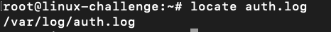
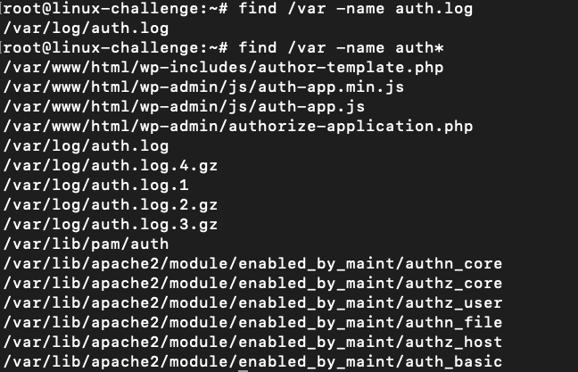
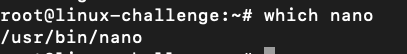

# Finding things...


Before we already took a look at ```find``` command, but we can diversify it:
* locate
* find
* grep
* which

## locate

It searches for an index that is managed by ```updatedb```, which run on a cronjob. For recently created files, it cannot operate well:



## find

It searches through a tree directory structure for files to **match** some criteria:



From previous lessons, we already saw that we can filter through its options:
* -type: d for directory or f for file
* -name: indicate a name for the file
* -iname: case insensitive search
* -not: exclude filter, and be with -path to exclude a path on the tree
* -regex: regular expression
* -a: AND operator
* -o: OR operator
* -perm: indicate permission
* -owner: indicate ownership
* -group: indicate group ownership
* -size: indicate size
* -xdex: limit descending on other file systems (not cross mount points)
* -mdite: modification time
* -delete: delete after search
* -empty: empty files
* -exec: execute a command after search, extremely powerful


Also, we can specify multiple directories:

```bash
find /home /root/ -type f -name "*.sh"
```


## grep -R

We can recursively search with ```grep``` with ```-R``` option. Just the ```-r``` would exclude symbolic links.

```bash
grep -R "Permit" /etc/* 
```

OBS: The ```-i``` option indicate insensitive case search
To search for words use ```-w```.
Moreover, to search for words over regular expressions ```-wo```.
To count the total occurrences: ```-c```.

## which

To get where the command is located:



We see that ```nano``` is placed at the user binaries ```/usr/bin/nano```.


# Extension

We can list open files with ```lsof```. We can specify files opened by a user:

```bash
lsof -u user
``` 

Moreover, we can indicate a PID and check which files run it:

```bash
lsof -p 890
```

For network debugging, with option ```-i``` we can indicate the network address to match:

```bash
lsof -i TCP:22
lsof -i TCP@127.0.0.1
```

