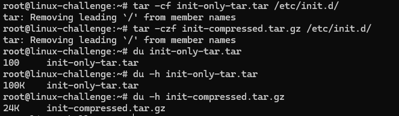
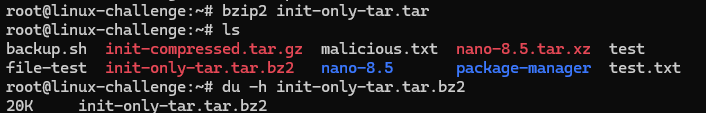
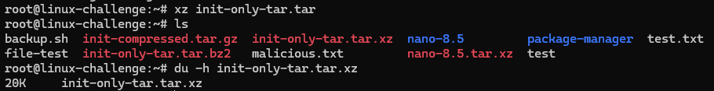
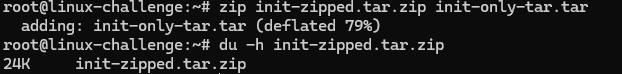

# Archiving and compressing

We have already at this point created and read tarballs. In essence, a tarball is an unit from several files into one, with gzip on top of it:

OBS: tar is for tape archive

```bash
tar -cvf result-file files
```

To compress it, we include ```-z``` option that is gzip in default:

```bash
tar -czvf result-file files
```

Let's compare the sizes with ```du```:



The size has drastically decreased by 76%.

# Comparing compressions

The widely used gzip uses DEFLATE algorithm, but there is a lot of more compression methods out there:
* bzip2: Burrows-Wheeler and Huffman algorithms, it can achieve better compression ratios:
  
It was 20% better than gzip!

* xz: LZMA2 algorithm with highest compression ratios:



For this time, it was the same for bzip2.

* zip: To easily distribute among operational systems, it is an option:


Surprisingly, it was the same for gzip.