# The infamous “grep” and other text processors

We will deep dive text manipulation with the well known commands: ```grep```, ```cat```, ```more```, ```less```, ```cut```, ```awk``` and ```tail```, as well redirection.

Since we created a barebones web server, let's scrap its logs.

```bash
cat /var/log/apache2/acces.log
```

Here we have the IP addresses that tried/logged on the server.
Then, from previously classes, we use ```less`` and its mentions *GG*, *gg*, */* with *N* and *n*.  

We can maintain the file output with ```tail```:

```bash
tail -f /var/log/auth.log
```

With this example, we can monitor in real-time which individuals try to log into our server.

We can crap this logs to another command (sdout > sdin) by using "pipe" (```|```):

```bash
cat /var/log/auth.log | grep "authentication"
```

The ```cut``` command is used to select portions of each line based upon a delimiter and  a field:

```bash
cut -f "field" -d "delimiter"
```

We can find login attempts that are not from root with ```-v```option in grep:

```bash
grep "authenticating" /var/log/auth.log | grep -v "root" | cut -f 10- -d" "
```
OBS: 10- is for 10th field and so on

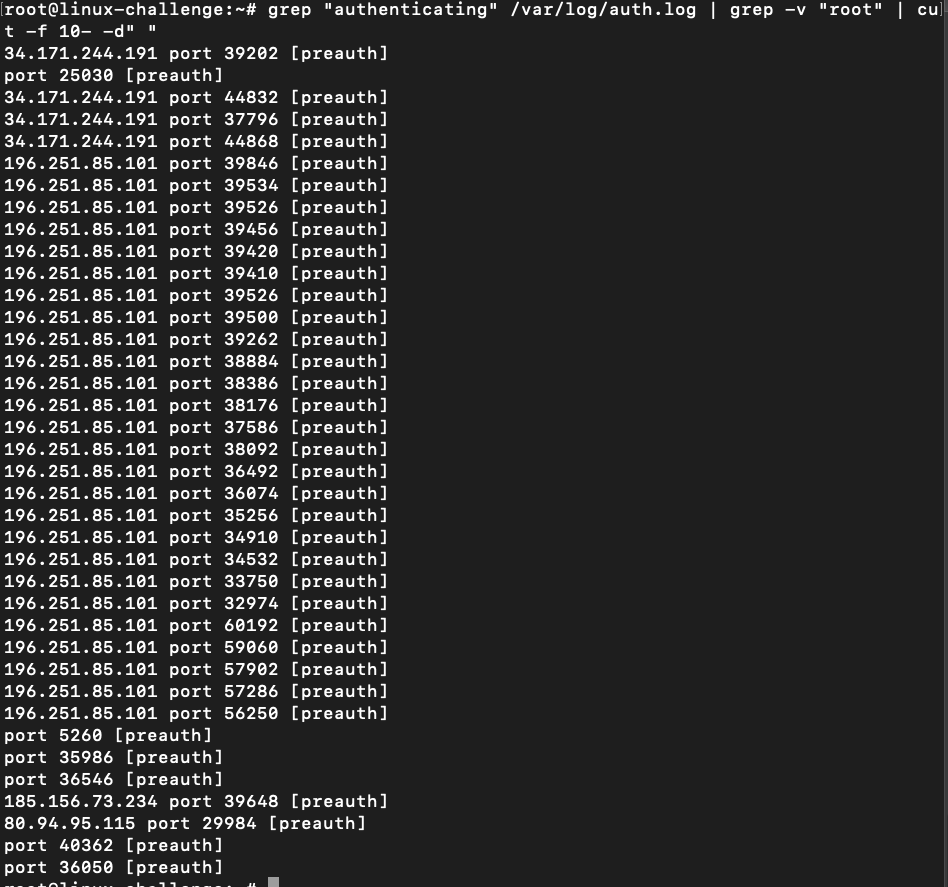

Cool command!

Finally, we can redirect it to file with ```>```operator:

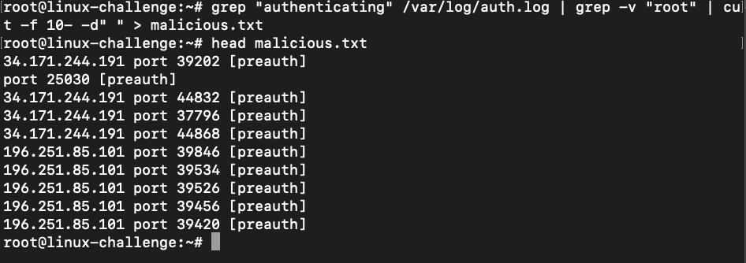

To optimize this, we sort the output and remove any repeated log:

```bash
grep "authenticating" /var/log/auth.log | grep -v "root" | cut -f 10d -d" " | sort | uniq
```

## sed

Some nice [manipulations](https://edoras.sdsu.edu/doc/sed-oneliners.html) with sed:

* spaces between each line: ```sed G```
* undo spacing: ```sed 'n;d'```
* count lines: ```sed -n '$='```

## awk

The command ```awk``` is more powerful than ```sed``` in terms that it is capable to understand fields, do calculus and has complex operators integrated.

We start with a simple ```ps``` command to check the active processes:

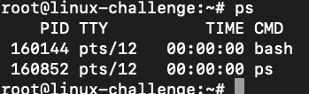

Let's grab just the first field (the PID):

```bash
ps | awk '{print $1}'
```

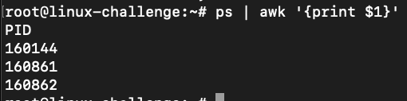

For default, the field separator is the *space*. However, we can change it on the fly with ```-F``` option:
```bash
awk -F ","
```

In this case, we indicated the *,* as the separator for the fields.
We check it under ```/etc/passwd``` file:

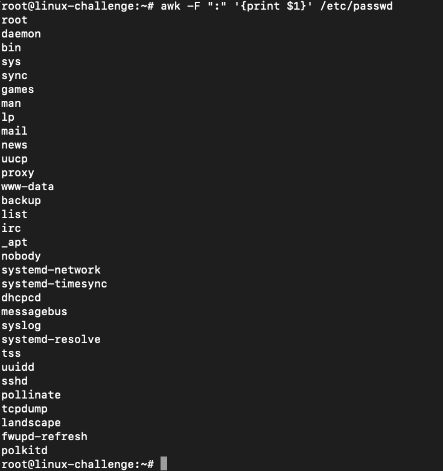

To print multiple fields on the same line, we indicate that it must be separated by a space:
```bash
awk -F ":" '{print" "$1" "$3}' /etc/passwd
```

This example prints field 1 and 3. It could be a proper tab (```\t```) between them.
We could type it as a singlle operator:
```bash
awk 'BEGIN{FS=":" ; OFS="-"} {print $1,$3}' /etc/passwd
```

We indicate the field separator (FS) and the output field separator (OFS). The BEGIN function just highlights that ```awk``` has its own *programming language*. Basically, it specify a set of instructions to be issued before the read.

The operations with regular expressions are bulti-in:

```bash
awk -F "/" '/^\// {print $NF}' /etc/shells | uniq
```

In this example, we use a FS equal to /, searches for lines that starts with / and print the last field.
* //: between these are the searching string


## Sad Servers "Saskatoon"

Desciption of the problem:

*Find what's the IP address that has the most requests in this file (there's no tie; the IP is unique).*

*Write the solution into a file /home/admin/highestip.txt. For example, if your solution is "1.2.3.4", you can do echo "1.2.3.4" > /home/admin/highestip.txt*

I run into some solutions:

```bash
awk '{print $1}' /home/admin/access.log | sort | uniq -c | awk 'NF==1 {max=$1} $1>max {max=$1; ip=$2} END {print ip}' > /home/admin/highestip.txt
```

```bash
awk '{count[$1]++} END {for (ip in count) {print count[ip], ip}}' /home/admin/access.log | sort -r | head -1 | cut -d " " -f2 > /home/admin/highestip.txt
```

The official solution:

```bash
cat /home/admin/access.log | awk '{print $1}' | sort | uniq -c | sort -r | head -1 | awk '{print $2}' > /home/admin/highestip.txt
```

## Sad Servers "The Command Line Murders"

We will investigate a crime scene, a funny way to manipulate the text with clues and find the culprit. It is based upon the the [repository](https://github.com/veltman/clmystery).

First, we open ```mystery/``` directory and ```grep``` the crime scene with **CLUE** keyword:

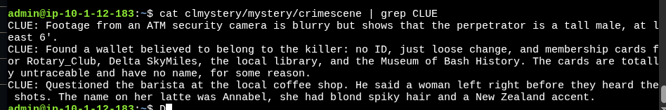


We focus on the height, locations that he has membership and the girl that left previously. The culprit is member of the Bash History Musem, Rotary CLub and Delta SkyMiles.

We ```cat``` all the members of these three locals and gather the ones that are members of all:


```bash
 cat Museum_of_Bash_History Rotary_Club Delta_SkyMiles | sort | uniq -c | awk '{if($1==3) print $2" "$3}'
 ```

 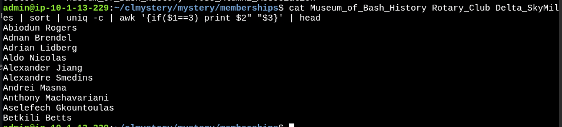

We ```grep``` Annabel on peoples description:

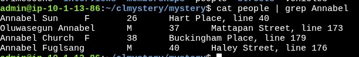

We check who of them has the same membership to the previously three locations: 
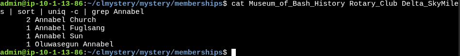

We have that **Annabel Church** has the most of the subscriptions, and the surname reveals a possible anglican name for New Zeland.

On *vehicles* files, we have a curios info: the owner height. The owner is above the heigh line:

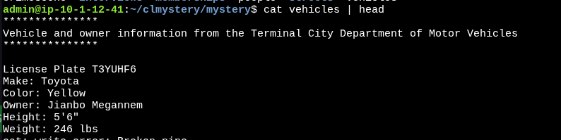


A option that will help on that is ```-B``` to the ```grep```:

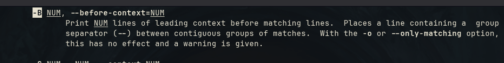

In other words, it prints the **n** lines above with the pattern found:

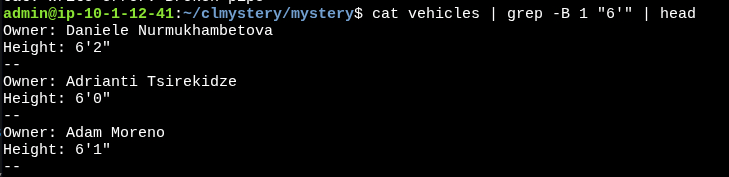

Finally, we ```awk``` it to consider the lines that matches **Owner** and prints the name:


We sort it and discard duplicates if the owner has more than one vehicle with ```sort -u```:

```bash
cat vehicles | grep -B 1 "6'" | awk '/Owner/ {print $2" "$3}' | sort -u
```

We get the names of the members of the three institutions by the clues given and insert it on a file:

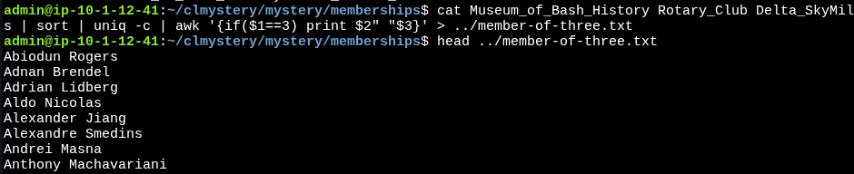

Also, the owner of the vehicles that are above 6':

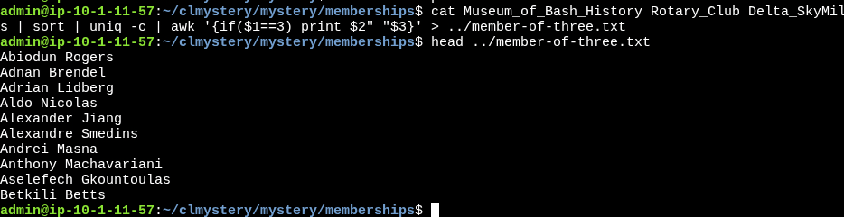


We compare each file to show the names that converge on both with ```comm``` command:

```bash
comm -12 file1.txt file2.txt
```

OBS: The option 1 and 2 supress uniqueness from both files, we want the ones that appear on both

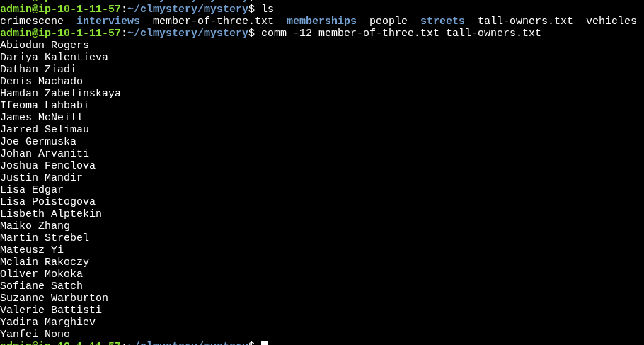

Was not sufficient to indicate the culprit. We investigate the **streets** file and check in **Buckingham Place** since it is where the Annabel has its description, and her has 2 of 3 memberships on the same place as the clue says.

On it, we have a interview code:


It advertises about a blue Honda:

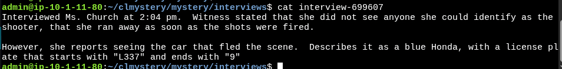

We extend the ```grep``` command on vehicles to include the color and the car:

```bash
cat vehicles | grep -B3 "6'" | grep -A4 "Honda"
```
OBS: The -A option is for above 4 lines between the pattern found

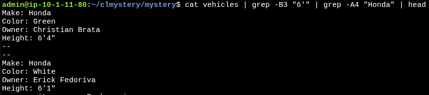

Still not enough, so we search for the Blue one:

```bash
cat vehicles | grep -B3 "6'" | grep -A4 "Honda" | grep -A2 "Blue"
```
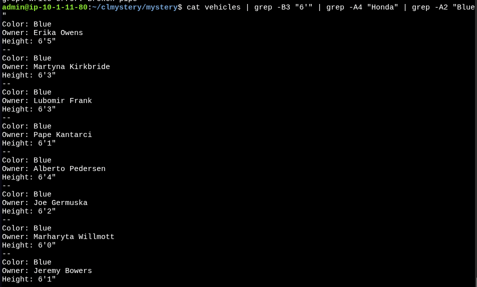

Comparing it with the previous .txt files, the only one that matches all these factors is **Joe Germuska**:


And he is the murder.


