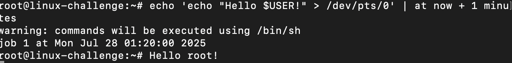
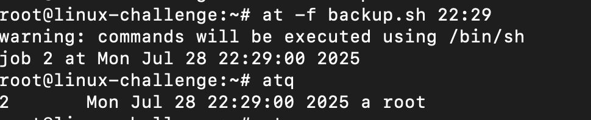
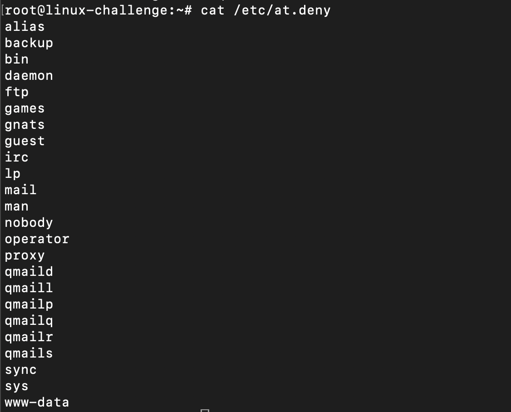
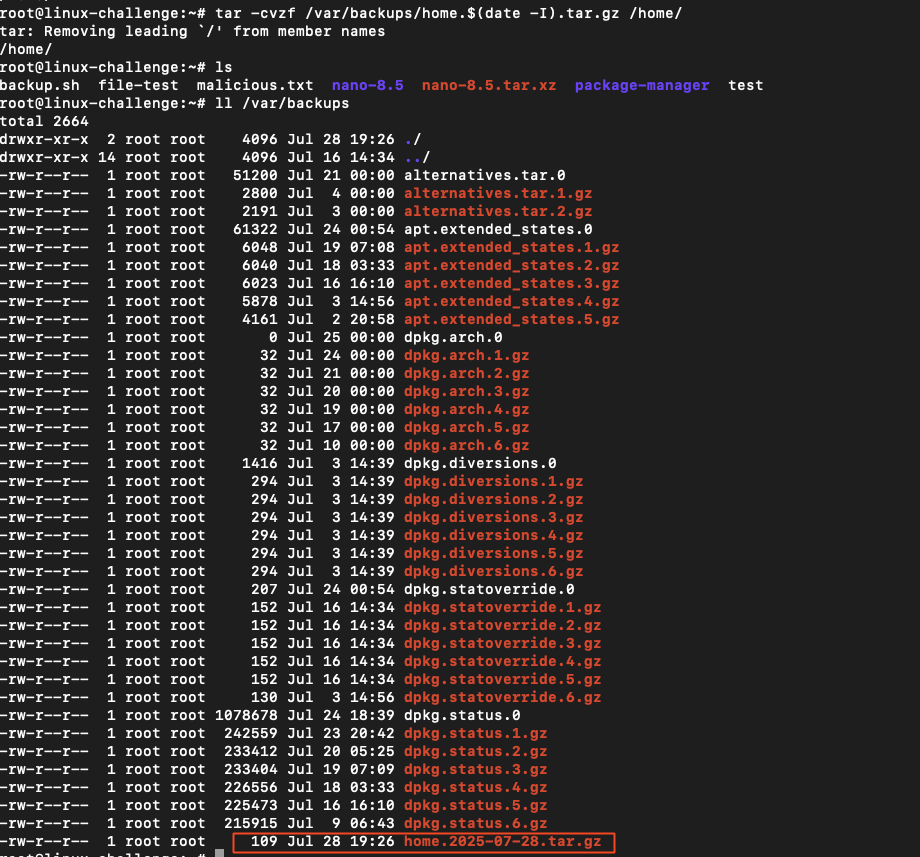
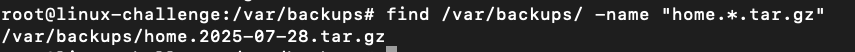
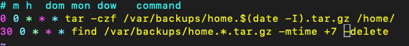
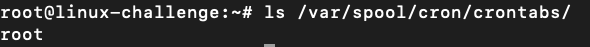
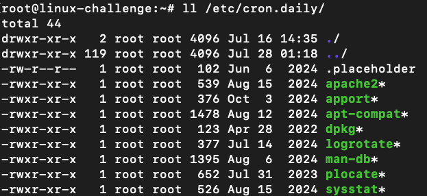

# Scheduling tasks

Let's deep dive into the time-based schedueler ```cron```.
First, we can use the following package:
```bash
apt install at
```

For example, we can print to the current ```tty``` being used:

```bash
echo 'echo "Hello $USER!" > /dev/pts/0' | at now + 1 minutes
```

We have created an one time task:



We can schedule scripts:

```bash
at -f backup.sh 02:00
```

To list pending jobs:
```bash
atq
```




The letter "a" represents the priority level that goes from "a", "b" and so on.

To remove it:
```bash
atrm <job-number>
```

We can specify which users can schedule with ```at``` at ```/etc/at.deny```. The default users by system are already denied:



## Crontab

An advanced feature is called ```crontab```, which is there that we manage to interact with scheduled tasks.
To list it:

```bash
crontab -l
```

To execute/create a **cronjob**, we can issue:

```bash
crontab -e
```

The schedule is placed:
* m: minutes (0-59)
* h: hours (0-23)
* dom: day of month (1--31)
* mon: month (1-12)
* dow: day of the week (0-7 for sunday=0 or 7)

Operators can be used:
* *: every possible time interval
* ,: multiple values separated by comma
* -: range of interval
* /: periodicity

Example: * * * * * (every minute of every hour of every day of every month of every day of the week)
Another one: */15 * * * * (execute every 15 minutes)


To remove all cronjobs from user:

```bash
crontab -r
```

It also can manage which user can have a crontab on ```cron.deny``` file at ```/etc/cron.deny```.


## Backup home directories

The cronjob is widely used for backups. To train that, we will compress all the home directory with a **cronjob**. 

We begin with the command we want to achieve:

```bash
tar -czf /var/backups/home.tar.gz /home/
```
OBS: -c to create, -z to gzip and -f to specify a file/directory

We can also include the date of the backup:

```bash
date -I
```

So would seem like:
```bash
tar -czf /var/backups/home.$(date -I).tar.gz /home
```




Let's create a cronjob for every day to run it:

```bash
crontab -e
```


However, we do not want to fill our backup full of files. We need another cronjob to clean it up. To ```find``` all the backup tarballs:

```bash
find /var/backups -name "home.*.tar.gz"
```

We use wildcard to show all that matches:



For find, we can use the flag ```-mtime``` to filter for how much time the file has been modified. Furthermore, we can delete it with another flag ```-delete```.

```bash
find /var/backups/home.*.tar.gz -mtime 7 -delete
```



On day 30th at 00:00 AM, backups older than 7 days will be deleted.
The system manages a crontab too at ```/etc/crontab```. The local user cronjobs are installed at ```/var/spool/cron/crontabs```:






In this case, each line is a script that runs daily and sequentially starting from ```apache2```.
