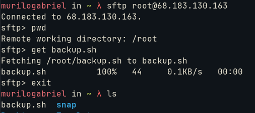

# Transferring files

Between servers, it is a common desire to exchange files on top of the network. We must be aware of some protocols:
* SMB: Microsoft file sharing
* AFP: Apple file sharing
* WebDAV: Sharing over HTTP
* FTP: Internet sharing protocol
* scp: simple copy protocol for files
* rsync: powerful to copy and sync files/directories
* SFTP: secure file sharing over SSH

  ## SFTP

  From previous lessons, we will get the ```backup.sh``` file from our VPS to the local computer:

  

  

