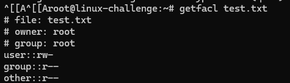
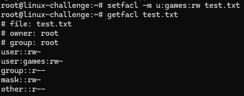
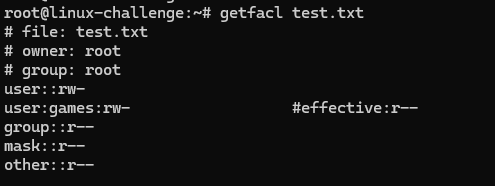

# Who has permission?

We will see how to manage permission for files in Linux.

## Ownership

To check ownershit, which is changed by ```chown```:
```bash
ls -l
ll
```

For a user:
```bash
chown user file
```

A group:
```bash
chgrp group file
```

## Symbolic notation

The permissions can be represented:

User - Group - Other ([UGO](https://acronym24.com/ugo-meaning-in-linux/))
rwx  -  rwx  -  rwx
421  -  421  -  421

## Changing permissions

To give a permission to the user be able to read and execute:

```bash
chmod 500 file
```

To all users be able to read:

```bash
chmod 444 file
```

The most permissive:
```bash
chmod 777 file
```


It can be also written:

The user be able to write:
```bash
chmod u+w file
```

To revoke it:

```bash
chmod u-x file
```


For groups and others:

```bash
chmod g+r file
chmod o+r file
```

# Extension

Manage permissions deeper on the system

## ACL

To control which ones can access the filesystem, it must be able to perform it (XFS, EXT2, EXT3, EXT4, BTRFS, ZFS). To check it out it must carry the flag:

```bash
tune2fsw -l /dev/sda | grep acl
```

We can remount the disk with this option:

```bash
mount -o remount -o acl /dev/sda1
```

To get the file ACL:



For a specific user to have permission on it:

```bash
setfacl --modify u:user:rw text.txt
#   OR
setfacl -m u:user:rw text.txt
```

It could be for groups and others too.




An entry for **mask** has appeared as a set of permissions that can be assigned on the file on groups and users, but no effect on file owner and other group:



We can see that the user ```games``` has been affected and now only have read permission. To completely deny access to a file:


```bash
setfacl -m u:user:- file
```

We can define a default ACL for all files created further on a directory:

```bash
setfacl -d -m u:user:rw directory
```

All files inside it will have read and write permission to the **user**.
To remove all ACL defined:

```bash
setfacl -b file
```


