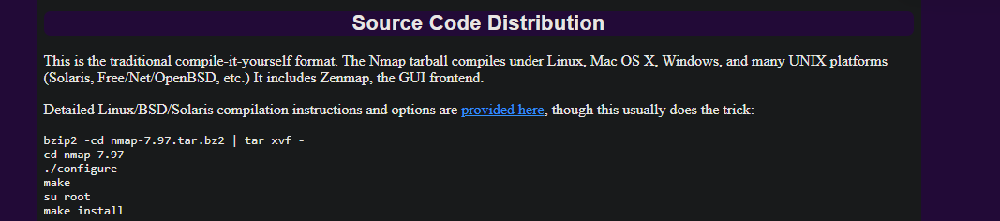
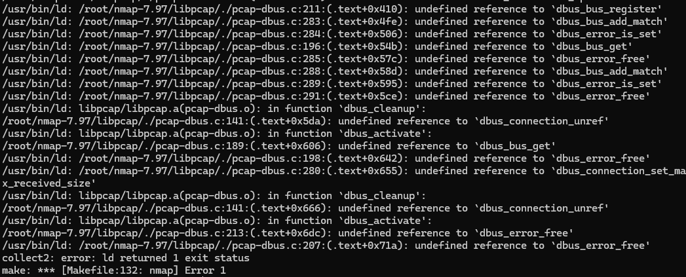

# Build from the source


Our package managers get the files as binaries pre-compiled. Under the hood, the binaries are built, dependencies installed and finally package delivered.

We will compile and install ```nmap``` to evaluate how it is done.

## Getting the source

```bash
wget https://nmap.org/dist/nmap-7.97.tar.bz2
```

As we see, it is bzip2 compressed. We could issue ```bzip2 -cd file``` and then extract the tarball, or do it on demand:

```bash
tar -jxvf nmap-7.97.tar.bz2
```

OBS: The option ```-j``` stands for uncompress bzip2 file first

On [Nmap page](https://nmap.org/download) we get already a summary of the source compilation:



The steps follows:

* ./configure: check the system and adapts the package to it (x84, x64, ARM)
* make: compiles
* make install: installs the compiled files into the root directory, environment data and variable data


When compiling nmap, an error arise:




