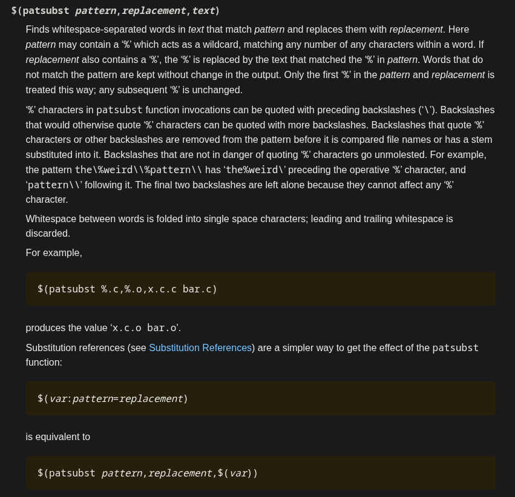

# Build from the source


Our package managers get the files as binaries pre-compiled. Under the hood, the binaries are built, dependencies installed and finally package delivered.

We will compile and install ```nmap``` to evaluate how it is done.

## Getting the source

```bash
wget https://nmap.org/dist/nmap-7.97.tar.bz2
```

As we see, it is bzip2 compressed. We could issue ```bzip2 -cd file``` and then extract the tarball, or do it on demand:

```bash
tar -jxvf nmap-7.97.tar.bz2
```

OBS: The option ```-j``` stands for uncompress bzip2 file first

On [Nmap page](https://nmap.org/download) we get already a summary of the source compilation:


The steps follows:

* ./configure: check the system and adapts the package to it (x84, x64, ARM)
* make: compiles
* make install: installs the compiled files into the root directory, environment data and variable data


When compiling nmap, an error arise:


The solution was to pass manually ```dbus``` package:
```bash
make distclean
pkg-config --libs dbus-1 #get system package config
LIBS="-ldbus-1" ./configure
make
```

A second error appears:


We install build package:
```bash
apt install python3-build
```

And it works now.

## Makefile

In order to deepen or concepts around compiling, we will use the Makefile script to learn it more.
The construction is made by directives and rules, that sequentially perform commands:

```makefile
all:
    echo "Hello World"
```

We can execute it via ```make```:


To execute it in quiet mode, we add:
```makefile
all:
    @echo "Hello World"
```

To return the commands on Makefile script without executing it:
```bash
make -n
```

The structure follows:
#target #dependency
    #rules (commands)

For example:


We can specify the target with parameters on make command:
```bash
make message
```

### Fortran compiling

we have the main program, modules and objects for compilation on Fortran. To it, we must compile the module to create the object file (harware capable to read):

```bash
gfortran -c module.f90 
```
It results on a module.mod and module.o files, the .mod has the function prototypes to be handled by the program. Finally, we run:
```bash
gfortran module.o program.f90 -o program
```

Now we have an executable:
```bash
./program
```


To illustrate this, we have created a simple sum function:

```fortran
USE module_lib
IMPLICIT NONE

REAL:: sum_result
REAL::a=1, b=2

sum_result = sumall(a,b)

WRITE(*,*) "Sum result is: ", sum_result

END PROGRAM
```

It has a dependency on module_lib:
```fortran
MODULE module_lib

    IMPLICIT NONE
    CONTAINS
        FUNCTION sumall(a,b)
            REAL, INTENT(IN):: a
            REAL, INTENT(IN):: b
            REAL:: sumall

            sumall = a+b
        END FUNCTION
    END MODULE
```


On Makefile, we have the recipes and dependencies for it. As stated, the dependency for ```program.f90``` file is ```module.f90``` module:
```makefile
program: program.f90 module.o
```

Furthermore, we need to compile the module first:
```makefile
module.o: module.f90
    gfortran -c module.f90
```

Finally, we issue the executable:
```makefile
program: program.f90 module.0
    gfortran module.o program.f90 -o program
```

### Compilation flags

During compilation, we can specify flags on the fly:
* -c : compile the following file
* -o: output on the following file
* -J: where to put .mod files on the following directory
* -I: where to find .mod files on the following directory


To build it on a more cleaner way, we partition the process into specific directories:
* /bin: executables (final step)
* /include: modules (.mod files)
* /src: programs (.f90 or .c files)
* /obj: objects (.o files)

We start to generalize our Makefile and create a standard for the directories:

```makefile

SRC = ./src
BIN = ./bin
INCLUDE = ./include
OBJ = ./obj

#$^ all dependencies
#$@ the target
#$< first dependency


all: lib exe

lib: module.o

exe:
	gfortran $(OBJ)/module.o $(SRC)/program.f90 -I $(INCLUDE) -o $(BIN)/program

module.o: $(SRC)/module.f90
	gfortran -c $< -J $(INCLUDE) -o $(OBJ)/$@
```

To scale it out, we must find a way to invoke the compilation for each .f90 file to create a .o file without naming it. We can see that every .f90 file would be named the same for a .o file, so we find a text function intrinsic to the Makefile:



It basically get a pattern and a path to replace based upon the var. The idea is to pass as a variable all the .f90 files, get the name for each source file and replace it as a object file:

```makefile
$(patsubst /src/%.f90, /obj/%.o/, /src/*.f90)
```

Finally, we create a scalable Makefile:


```makefile

SRC = ./src
BIN = ./bin
INCLUDE = ./include
OBJ = ./obj

TARGET = $(BIN)/program
SOURCES = $(wildcard $(SRC)/*.f90)
OBJECTS = $(patsubst $(SRC)/$.f90, $(OBJ)/%.o, $(SOURCES))

#grab .f90 files and replace them as .o files destined to obj/ directory

COMPILER = gfortran

#$^ all dependencies
#$@ the target
#$< first dependency


all: $(TARGET)

$(TARGET): $(OBJECTS) #previous exe, linking stage
	@mkdir -p $(BIN) $(INCLUDE)

	$(COMPILER) $^ -J $(INCLUDE) -o $@


$(OBJ)/%.o: $(SRC)/%.f90 #compile every object, previous lib
	@mkdir -p $(OBJ)

	$(COMPILER) -c $< -J $(INCLUDE) -o $@

clean:
	@rm -rf $(OBJ) $(BIN) $(INCLUDE)

#not confuse clean and all as files
.PHONY: all clean
```

We just named the executable file.
An easy way to do the replacement of .f90 to .o would be:
```makefile
OBJECTS = $(SRC:.f90=.o)
```

However, the objects should be on the same directory and we proposed it to be on /obj/ directory.