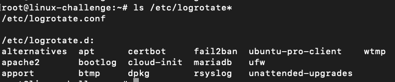

# Logs, monitoring and troubleshooting

We have learned a way to keep logs with ```cronjobs```. However, an application ```logrotate``` facilicate this managing the days to log and compression, even store it on another server.

At ```/var/log/apache2``` we can check this out:


The older logs are maintained compressez on ```gzip``` from .gz extension. To configure it, we check ```/etc/logrotate.conf```:


As we can see, the rotation is weekly and maintains 4 weeks on total. However, it can differ per application:



For Apache2:


It keeps daily logs and maintains 14 days on total. It matches the last log from access: ```access.log.14.gz```.

As expected, it is actually maintaned on cron.daily:


## SadServers: “Manhattan”: can’t write data into database

*Your objective is to be able to insert a row in an existing Postgres database. The issue is not specific to Postgres and you don't need to know details about it (although it may help).*

*Helpful Postgres information: it's a service that listens to a port (:5432) and writes to disk in a data directory, the location of which is defined in the data_directory parameter of the configuration file /etc/postgresql/14/main/postgresql.conf. In our case Postgres is managed by systemd as a unit with name postgresql.*

We first run the command to insert a row:


We issue ```ss``` to check listening ports:


The port 5432 is not there. On logs:


On config file, we see a important note:


It is not listening on localhost. We remove it through vim:


We restart the service and look through the logs:


Still without working, we now check the data_directory config:


Validating the sizes, we confirm that ```/opt/pgdata/main``` is on full usage:


We end eliminating some files on the directory:
```bash
rm /opt/pgdata/main/file*.bk
```

And now it works.


