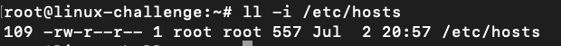
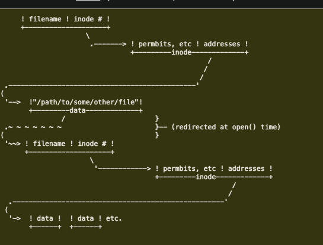
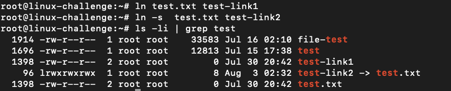
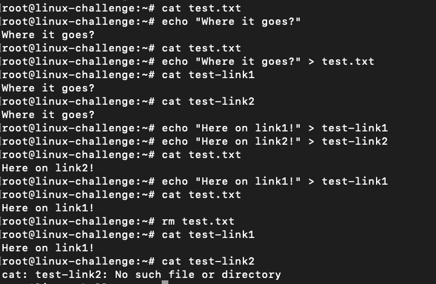

# Inodes, symlinks and other shortcuts


How files are stored?

Besides the filesystems, underlying it has the Linux Virtual Filesystem.
The layer between filename and data on disk is the *inode*, numerical identificador for the particular file:



For ```/etc/hosts``` file, it has an inode of 109. It points to the actual data on disk (pointer). Distinct filenames could have the same *inode*, as we call it **hard link**.

Any modification on each file affects the data inside it. Another important thing is that permissions and ownership are kept at the inode level.

## Symlinks

To create a **hard link** as mentioned:
```bash
ln /etc/passwd link1
```

On other hand, we have symlinks or **soft links**. It can link directories and reference file/directories between different volumes.
Actually, it reference the abstract filenames/directories and do not have the same **inode** (do not point to the same physical location on disk), so it has its own inode that... points to another inode:



To create **symlinks**:
```bash
ln -s /etc/passwd link2
```

For example, I have created both for a text file:



Doing some tests, we see that the symlink has its inode pointing to the actual file. Once it is deleted:



It stops its link, but the hard link maintains the inode even the actual file has been removed.

