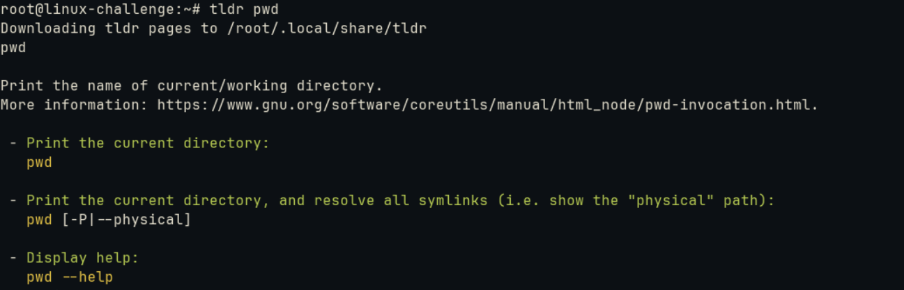
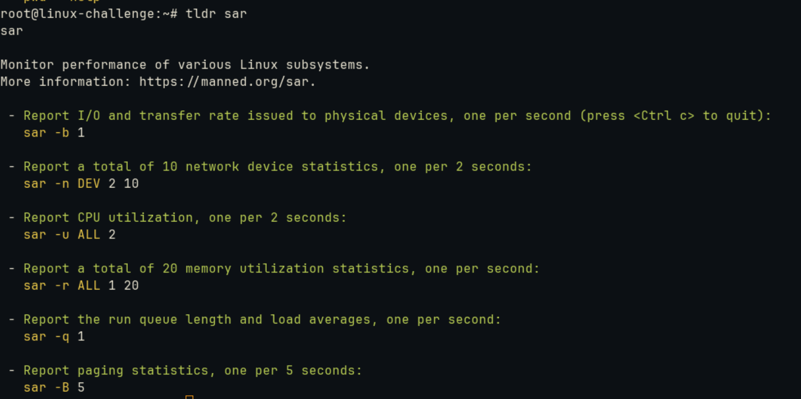
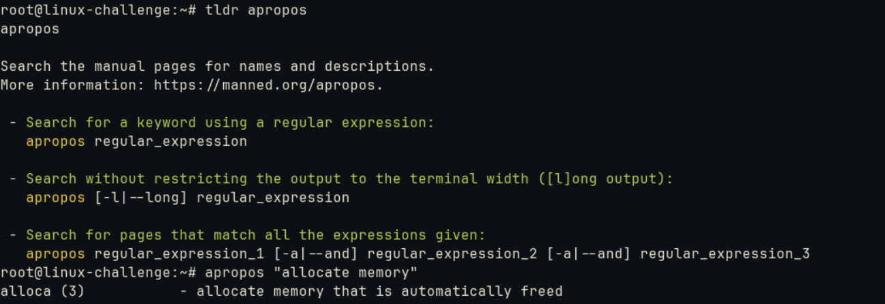
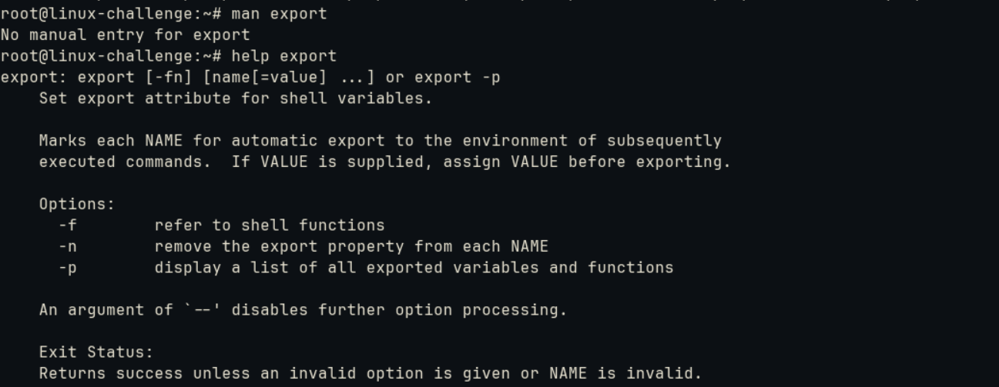
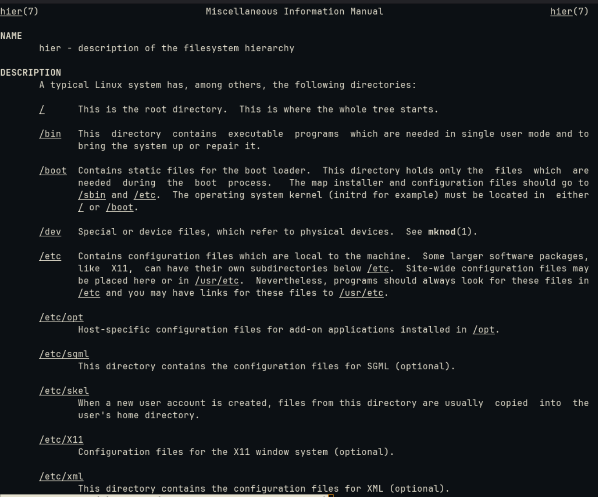
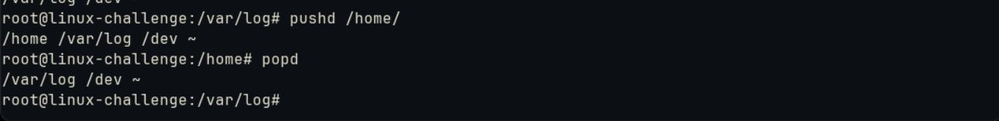

# Basic navigation


## Manual pages
On a terminal, we are surrounded by a huge ammount of commands that we don't necessarily know its details.
For that, we have the well known ```man``` command to check the official guidelines. However, we will face some other powerful tools.

The first one is ```tldr```, which gives a simpliefied and community-driven man pages. However, man pages are internally downloaded on Linux. For **tldr**, it is done on demand:



It included some examples:



For a particular task that we want to perform, we can search for descriptions with ```apropos```:



OBS: It is the same as ```man -k```, which searches for strings on the command description.

When a command don`t have a man page, we can use ```help```:



Built-in commands won`t have man pages. We can check it with ```type```:

```
root@linux-challenge:~# type export
export is a shell builtin
```

## Filestructure


A cool command to overview the Linux filestructure is ```man hier```:




Let`s get into it:
* **/**: root
* **/bin**: executables
* **/boot**: static files for bootloader
* **/dev**: device files
* **/etc**: local configuration files
* * **/etc/opt**: host-specific
* **/home**: user directory
* **/lib**: shared libraries for boot and run commands on root directory
* * **/lib4**: libraries that support more than one binary format
* * **/lib/modules**: loadable kernel modules
* **/media**: mount points for removable media
* **/mnt**: mount point for temporarilty filesystems
* **/opt**: add-on packages
* **/proc**: mount point for *proc* filesystem, which contains information about running processes and the kernel
* **/run**: system description since boot, can be on */var/run*
* **/sbin**: commands that need super-user on boot


Those are the ones we face most of the time.

## Extension

We can carry multiple directories with ```pushd``` and ```popd```.

For example, I can save */dev*, */var/log* and */home* directories to use and alternate between them. If I issue ```popd```, it is discarded from the list:

