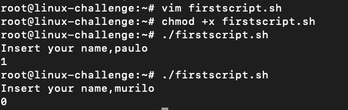
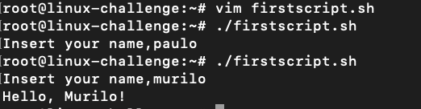
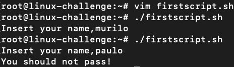

# Scripting

Final day!
Nothing more honorable than talk about Bash scripting.
Every script start with the binary that will load it, normally named "shebang":

```bash
#!/bin/bash
#!/bin/sh
#!/usr/bin/perl
#!/usr/bin/env python3
```
The **env** permits to assign dinamically the interpreter for the script, making it portable.


## First script


Let's read an entry from the user and print it:

```bash
#!/usr/bin/env bash

read -p "Insert your name" name
test "$name" = "murilo"
echo "$?"
```

It must have the execution permission, or execute it with ```bash```:



To execute a command only if the test has status 0 with logical AND, we can use:
```bash
test "$name" = "murilo" && echo "Hello, Murilo!"
```



On the other way, we can check if the test has status 1 with logical OR:

```bash
test "$name" = "murilo" || echo "You should not pass!"
```



We can test it altogether by grouping commands and giving exit codes:

```bash
#!/usr/bin/env bash

read -p "Insert your name", name
test "$name" = "murilo" \
&& { echo "Hello, Murilo!"; exit 0;} \
|| echo "You should not pass!"
```

If the name matches, it exits.
The ```test``` function can be replaced to an expression:
```bash
test "$name" = "murilo"
[ "$name" = "murilo" ] #must have spaces at the beginning and end
```

Some options:
* -d: verify a directory existence
* -e: verify if a file exists
* -r: verify read permission
* -w: verify write permission
* -x: verify execution permission
* -L: verify a symlink
* -O: verify if the user is the owner of the file
* -f: verify if it is a file
* !: deny the test, it exists 0 if the test fail


## Verify connectivity

We select a domain that returns the IP address and try to get a website without downloading it with ```--spider``` option:

```bash
#!/usr/bin/env bash

server="icanhazip.com" #API to get ip address

echo "Verifying connectivity..."
if ! wget -q --spider www.google.com; then
        echo "No internet!"
        exit 1
fi      

curl -s "$server"
```

If the ```wget``` exits without access, the ```if``` context is accessed and no internet is confirmed.
