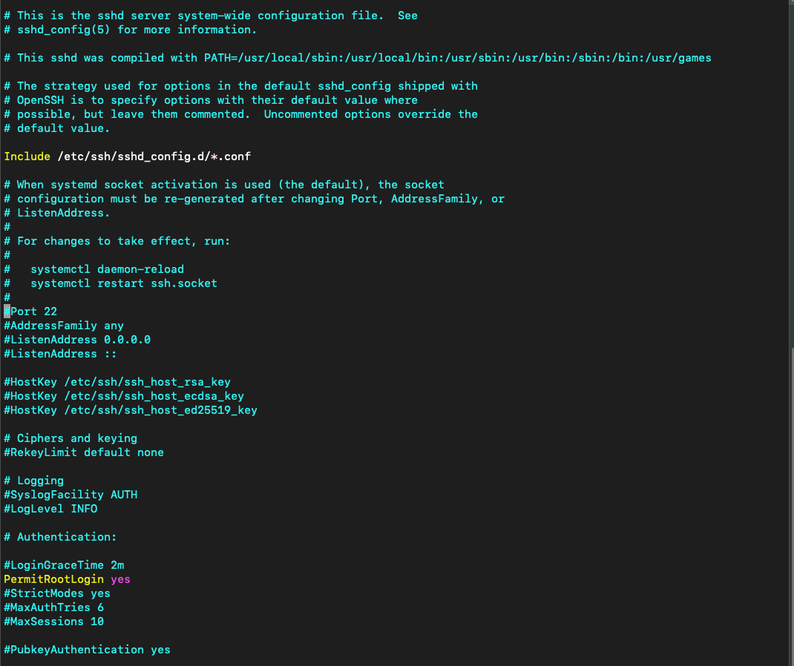
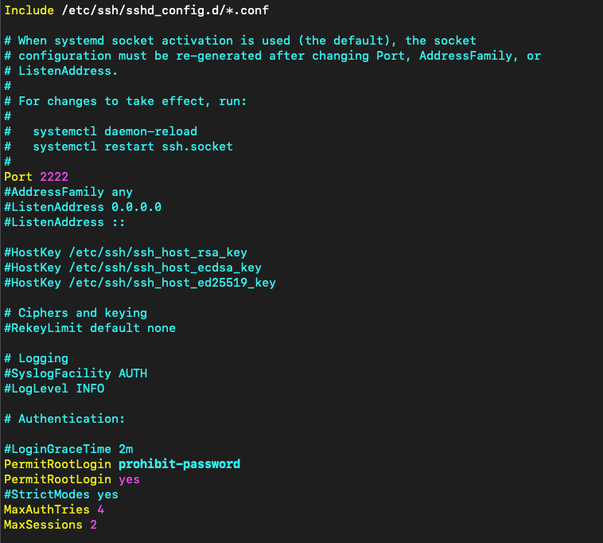
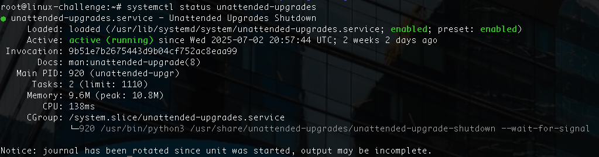
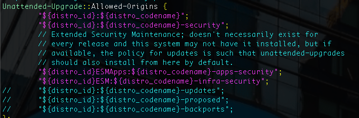
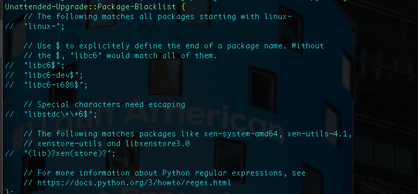
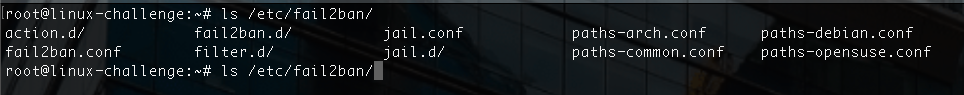
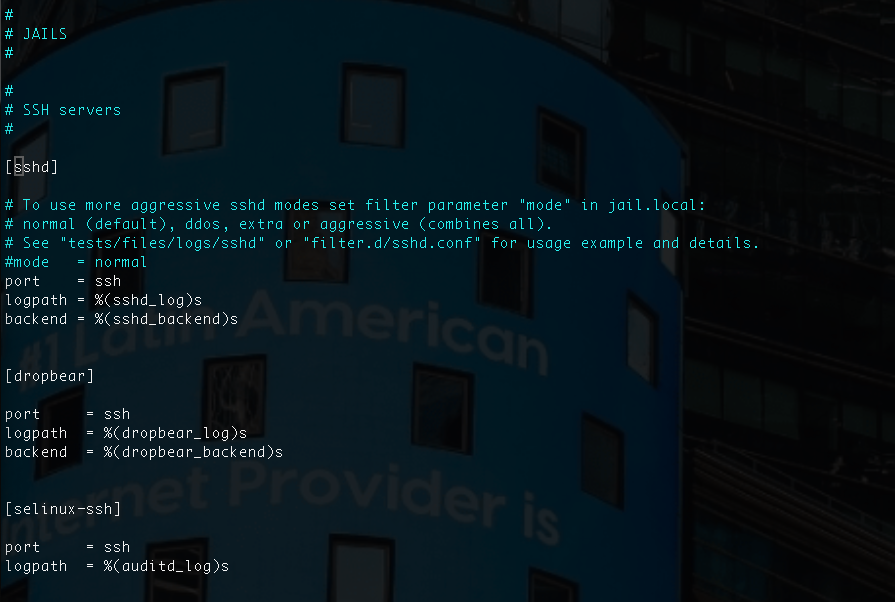

# Power drip

Since we are using DigitalOcean VPS, we have access to root:


In order to granulate permissions and avoid commands at free usage, we add a user to the system:


Then, we add it to **sudoers**:
```bash
usermod -aG sudo murilogabriel
```
Now we test it with ```su -```(the dash ensures environment variables load):


Let's push some commands:


We need to use superuser in order to use these commands. After an issued ```sudo reboot```, we analyze how a normal user face it:


The configuration to disable login as root is on ```/etc/ssh/sshd_config```.
After that, we need to reboot:

```bash
systemctl restart sshd
```


## Extension
With great power comes great responsibility...

### How to edit sudoers file?
The **/etc/sudoers** file indicates the privileges allowed for each user.

The command ```visudo``` is a way to get directly into edit mode of **sudoers** file in vi or nano mode:


The *env_reset* option resets the terminal environment remove leveraging **sudo** for a command. For bad passwords attempts, it mails to **mailto** user, normally the root account.
Finally, the *secure_path* indicates where the operations for the sudo user resides.


Above, we have the permissions for the users configured. It reads:
* **root** ALL=(ALL:ALL) ALL: user that it is applied
* root **ALL**=(ALL:ALL) ALL: hosts that it is appleid
* root ALL=(**ALL**:ALL) ALL: can run command as these users
* root ALL=(ALL:**ALL**) ALL:  can run command as these groups
* root ALL=(ALL:ALL) **ALL**: commands allowed

Let's create a user *teste* that is only capable to reboot the system:


## ```sudo -i``` vs ```sudo -s```

We will compare based upon the man page:


For the shell command, it creates another session but maintains the environment data from the current user. The interactive shell is powerful because it creates a new environment for the root with its configuration files.

## SSH Tunneling

### Local port forwarding

We can tunnel a connection local from a random port to map a known port on the remote host:


For example, if our firewall blocks RDP port, we can assign port 8080 locally to map 3389 on the remote host, on this example as the home computer. All this tunneled on a SSH session:
```bash
ssh -L 8080:10.1.1.1:3389 user@IP
```
We simply bind it local to destination.

### Remote port forwarding

We can do it in the same way for a remote socket:
```bash
ssh -R 8080:localhost:4444 user@IP
```

On this command, we bind 8080 port from the remote host to our 4444 port.


It can be malicious since all traffic destined to 4444 port will be forwarded to server.
We can practive this allowing it on our VPC under **/etc/ssh/sshd_config**:


We must allow *GatewayPorts* and *AllowTcpForwarding*.

We can allow some ports, but we test it for local port 8888 to port 80 on our VPS:


OBS: The option **-N** is to not execute any command, just to listen.

When we open a web browser and search for **localhost:8888**:


We get a error, but it confirms a port forwarding.

### Dynamic port forwarding

The ultimate destination is determined runtime, in another words, a SOCKS proxy server will be in place.

A SSH server being the intermediate between a remote server and a backend can listen to a specific port and forward to a dynamic port on the end.


To reach this, we need to issue:

```bash
ssh -D 8888 user@IP
```

The option -D is the key to dynamically assign a port on the server reached by its IP.

## Securing our own VPS

We will manage ```/etc/ssh/sshd_config``` to select the most important fields to secure our server:



The options are:

* Port : change the default port
* PermitRootLogin : deny root login (no) or deny root login with password (prohibit-password)
* X11 Forwarding : deny GUI access
* MaxAuthTries : reduce authentication attempts to block the IP
* MaxSessions : maximum concurrent sessions
* ClientAliveInterval : maximum time of inactivity to withdraw access
* PermitEmptyPasswords : revoke empty passwords usage
* PasswordAuthentication : revoke password authentication




OBS: To share public SSH keys between devices we can use ```ssh-copy-id``` command:

```bash
ssh-copy-id -i ssh-file user@ip
```

### unattended-upgrades

To keep track of current packages that need upgrade, the software *unattended-upgrades* is there to handle:



Let's get into the .conf file:

```bash
vim /etc/apt/apt.conf.d/50unnatended-upgrades
```


It checks for security patches for our distro.
We can blacklist packages:



We can run to check possible upgrades:

```bash
unattended-upgrades --dry-run --debug
```

### fail2ban

In order to prevent brute force attacks on our SSH server, fail2ban monitors it actively and block briefly the atacker's IP address.

It is imperative to have it on our VPS:

```bash
apt install fail2ban
```

It creates global variables attached to it:


On ```/etc/fail2ban/fail2ban.conf``` we can define log level, log file to load and the period to purge bans.

OBS: Configuration files tend to be overwrited when the system updates
To avoid this, we copy these files as **.local***:

```bash
cp fail2ban.conf fail2ban.local
cp jail.conf jail.local
```

Useful flags:
* bantime: time that the IP is kept banned (-1 to configure a forever ban)
* findtime:  period for attempts
* maxretry: max attempts to login

To configure jails to SSH, we have to alter on profile sshd:



To actually activate the jail, we need to insert the flag:

```bash
[sshd]
enabled = true
```

And since we modified the default port for SSH, we have to indicate it too:
```bash
ports = 2222
```

All jail profiles could be below ```jail.d``` directory, for example a ```sshd.local``` file with all configurations just for SSH service.