# Installing software, exploring the file structure

We will grasp how to manage the package installer, for now the **apt**.

We can search a package with:
```bash
apt search "package"
```

And we can install it:
```bash
apt install mc
```

## Creating our own package manager

### Introduction

I will leverage this topic to learn how to create a package manager with [Slackjeff](https://slackjeff.com.br/) course! 

At the beginning, all packages installed should be compilled and its files distributed on */sbin* and other directories. To remove or update it, the user should keep track for all the files generated and exlude these one by one. The hardcore would create a script to automatically perform this all.

At this age that the **package manager** was created, in 90s era.
We can classify it in low level and high level.

The low level tracks all libraries that will be installed and do all of it operations (create, update and delete) Examples:
* dpkg
* rpm
* pkgtools
  
In other hand, the high level will get the package from a mirror on the web, evaluate dependencies and forward to the low level. Examples:
* apt
* yum/dnf
* pacman


### Simulation

To proceed with atomic install, we need to do a **fakeroot** of the package. As an example, we will compile *nano* and proceed to create a package:

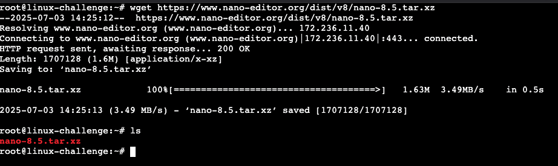

We can extract it via ```tar```:

```bash
tar xvf nano-8.5.tar.xz
```

Upon compilation, we can modify parameters so it is not dispose on root directories:

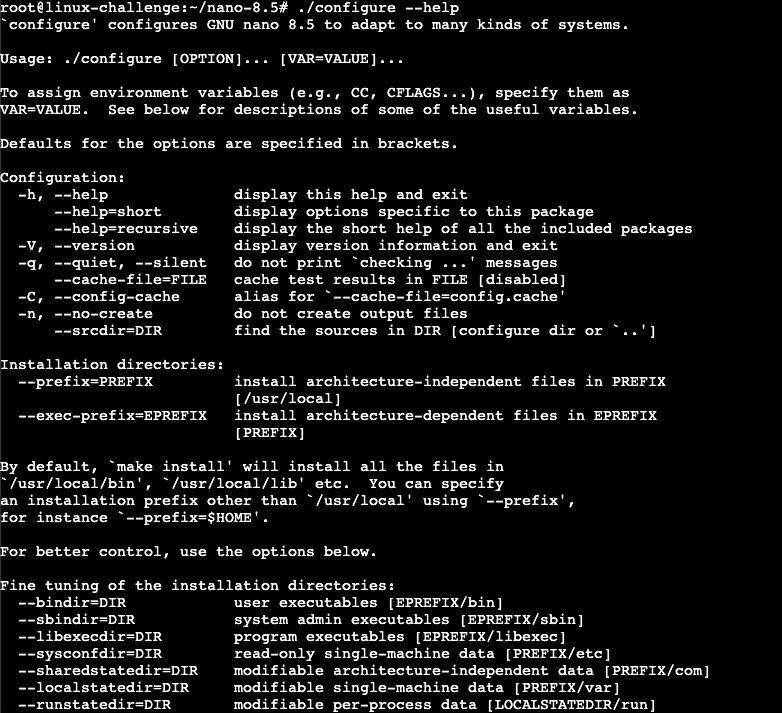

For testing purpose, we only add ```prefix==/usr/``` in order to create a directory above the binaries and share environment. Finally, a make install on the destination directory so it can be ***fakerooted***:
```bash
make .
make install DESTDIR=/tmp/nano-test/
```

We are able to execute it as the system would do:

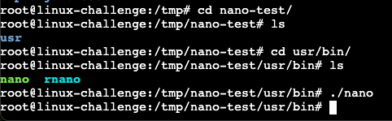

We create a tarball from the ```/usr/```folder:

```bash
tar cvf nano-8.5.newpkg .
```

In the end, the package manager would extract that tarball and point it to the respective directories, as following:
```bash
tar xvf nano-8.5.newpkg -C /
```

It will work just as it is ```nano```:

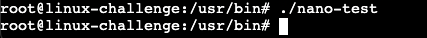


### Operations

Let's focus on the low level.

In order to encapsulate each function, we implement for each (create, update, install and delete).

#### Createpkg

On this operation, it has to attend some validation on:
* name
* extensions
* version
* build

And the package some prerequisites:
* unique name
* no spaces on it
* unique extension
* count hifens

We start with a shell script to create a package by its argument and check if it is empty:
```sh
case "$1" in #pkg argument
        create|-c) #create or -c operator
                shift #remove the inital argument on the queue (go to the next) to get package name
        #the -z is a operator to test if the string is empty
                if [ -z "$1" ]; then
                        printf '%s\n' "Package is null" #%s pass a string, in this case a new line
                        exit 1 #exit digit
                fi
        ;;
```

We can implement the create package function with command ```tar```:
```sh
#function
CREATE() {
        pkg_name="$1" #empty argument verified below
        if tar -cvf ../${pkg_name}. .; then #pack the package as a tarball
                printf '%s\n' "Package created: ${pkg_name}"
                return 0               
        else
                printf '%s\n' "Package failed: ${pkg_name}"
                exit 1
        fi
}
```
Let's try it out by giving it execution permission:

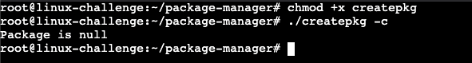

Afterwards, we can create this shell script as a process to the superuser (```/usr/sbin/```):

```bash
cp createpkg /usr/sbin
```

From previous compiled app ***nano-test***, we can compile it to the source with this new script:

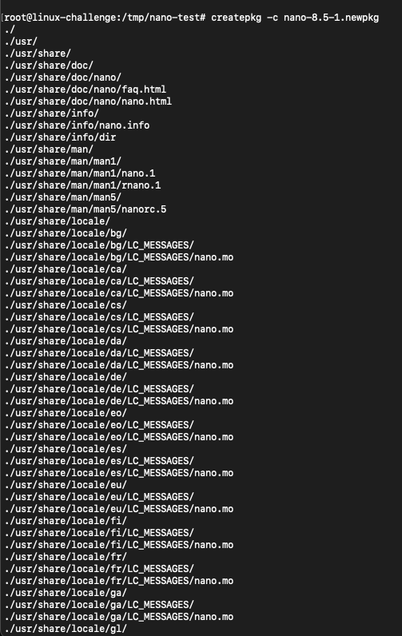

We can see the package created: 

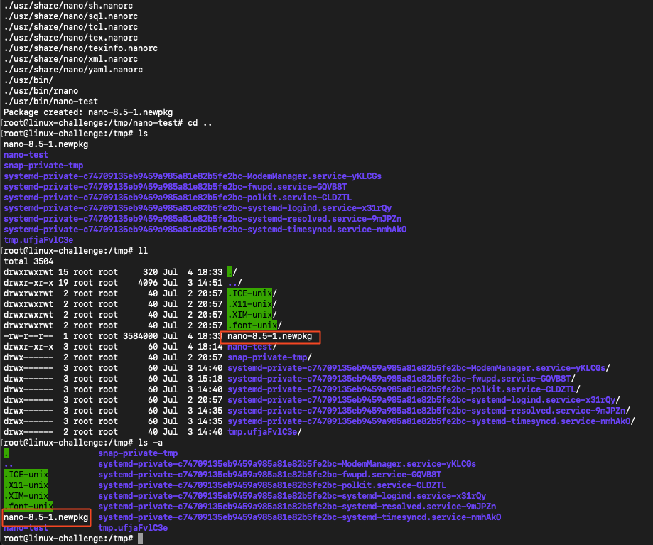

OBS: We can use ```sh -x``` to check which contexts the execution passes for a specific argument.

The optimization is done in order to get multiple packages and check it all in a ```for``` loop, also encapsulating the variables as ```local```:

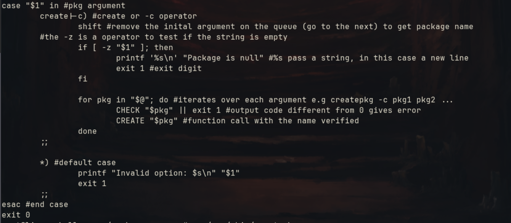


We can check it working:

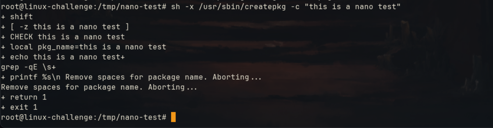

Now, we validate the package extension:

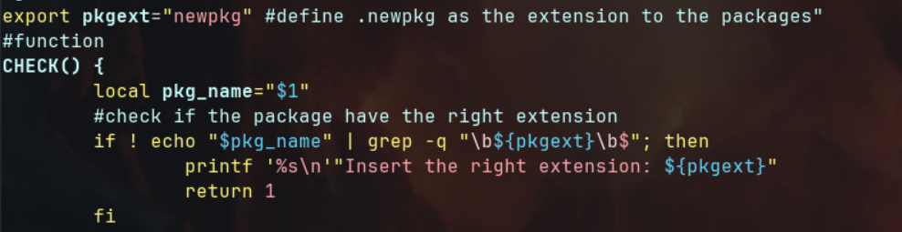

Validating:

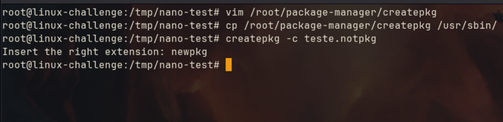

Now we guarantee that it includes version+build (e.g., package-1.0-1, in other words version 1.0 build 1):

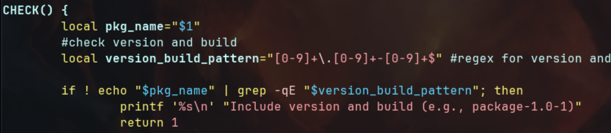

Validating again:

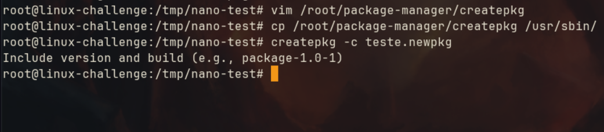

To desaggregate the code, we use a **parser** in order to append options:

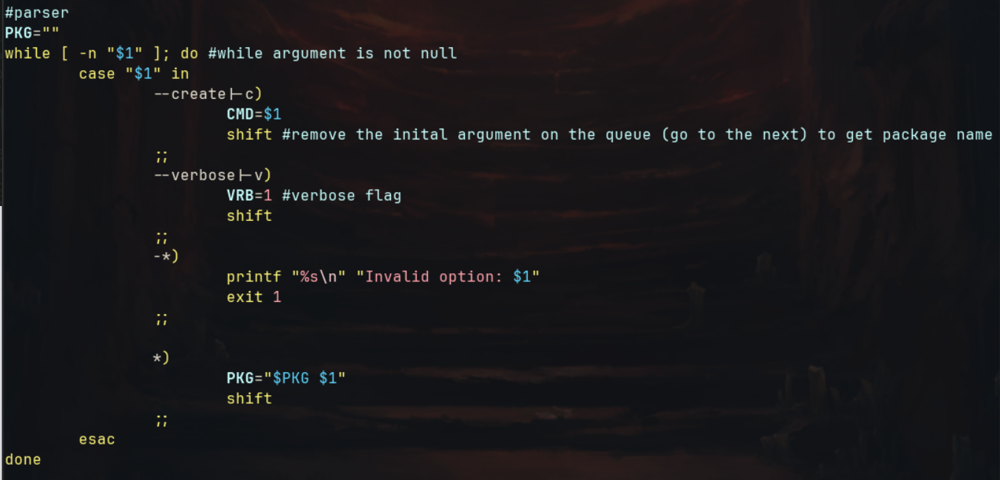

It validates options *verbose* and *create*, also append every package that goes on.

Our main case that invokes the functions to check and create get its argument modified by the output of the parser:

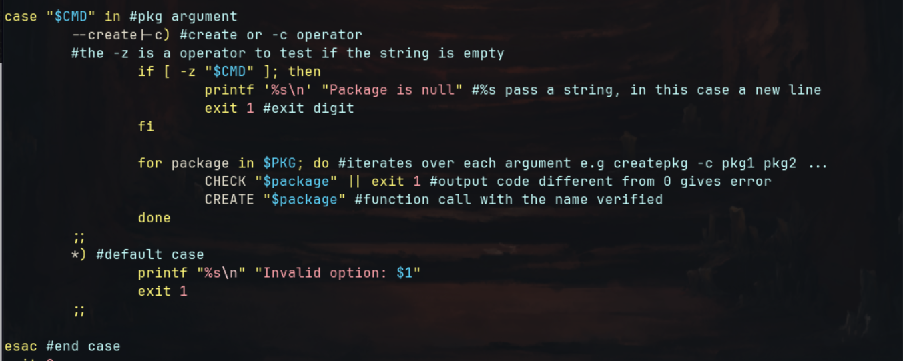

A function to instruct how to use the package is used (like a ```--help```): 

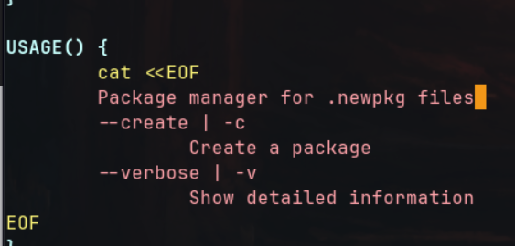

We can test it:

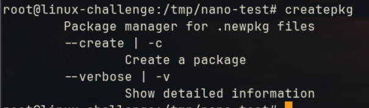

#### Installpkg

Ubuntu stores package installation details in ```/var/lib/dpkg/status```:

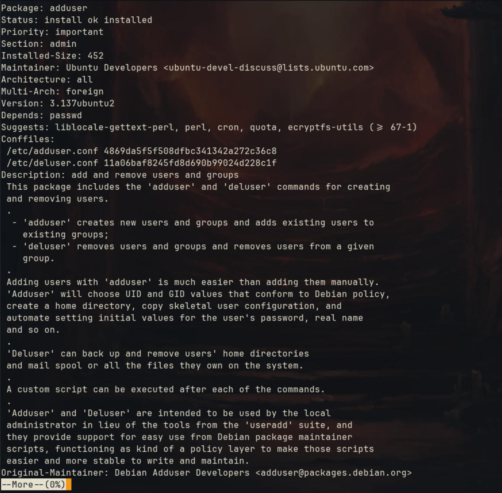

In order to install and uninstall a package, we have to **track** all of its extensions and binaries downloaded. As seen above, Ubuntu and other distros do it on some ways.

We will create our own tracking system. It will reside on ```/var/log/newpkg/```. We first create a simple test if the directory is created:

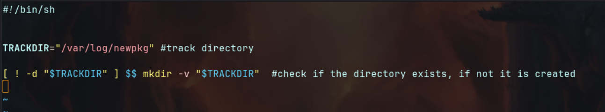

OBS: The logical OR is wrong, it must be ```&&``` and not ```$$```

Testing it:

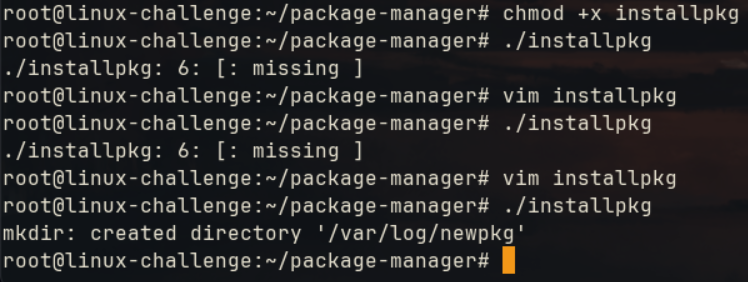


For now, we create a install function with the tar verbose as output to the track:

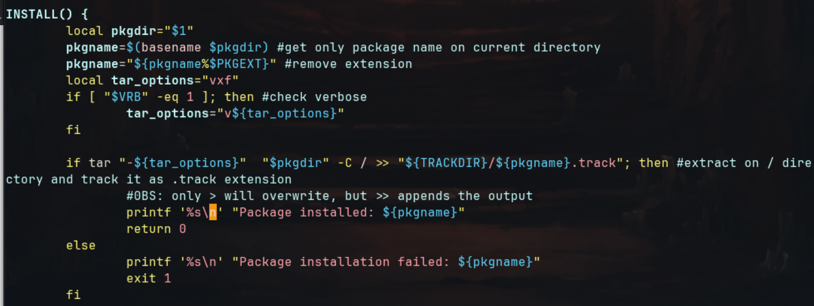

Below we test the script:

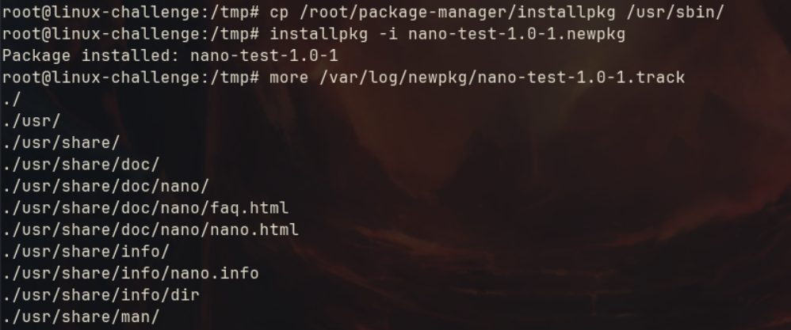

We have to clean the track for only the important modifications. As you can see, it shows all the directory starting from ```\.```. We can filter it with ```sed```:

```bash
sed 's@\.\/@/@g;' '/var/log/newpkg/package.track'
```
It will remove the root directory from the logs:

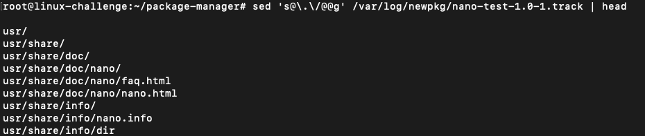

We can still remove empty logs:
```bash
sed '/ˆ$/d' '/var/log/newpkg/package.track'
```


Now, we want it to only filter for files, as example:
```bash
/usr/share/doc/nano/ #discard
/usr/share/doc/nano/faq.html #consider
```

Finally, we can filter:
```bash
sed '/\/$/d' '/var/log/newpkg/package.track'
```

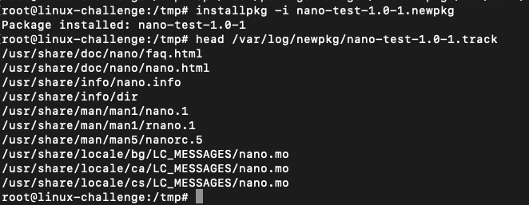
 
We must be able to install multiple packages, so we add a ***parser*** and a for loop to each one:

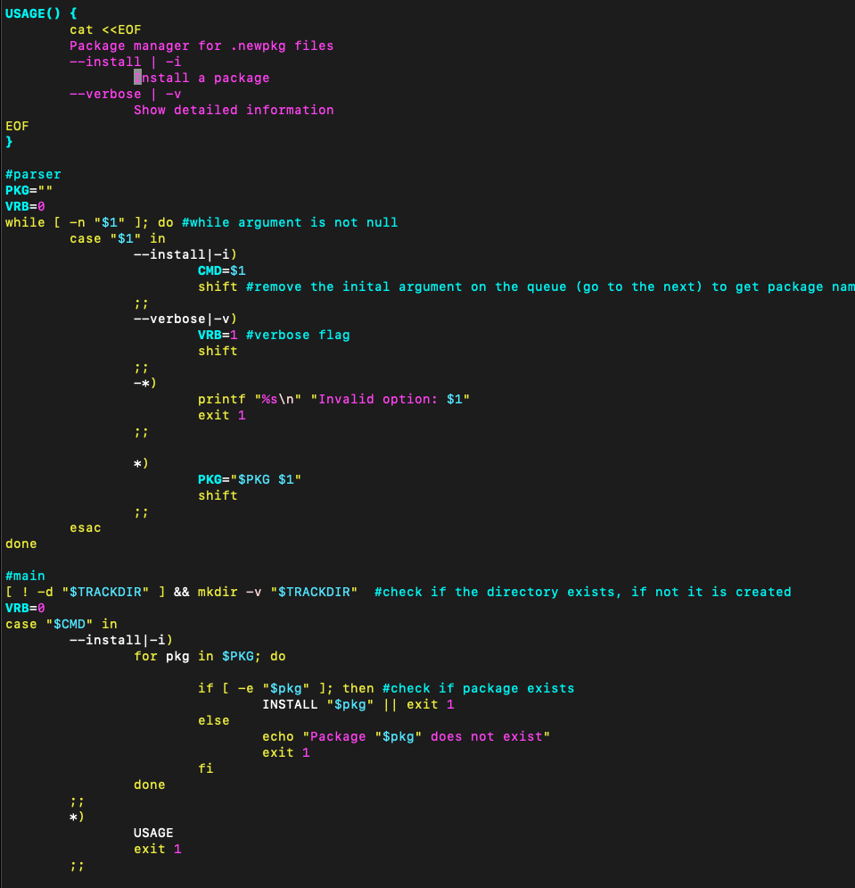

Validating:

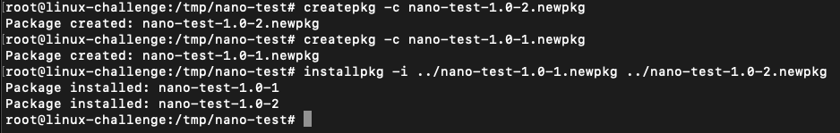

#### Removepkg

To remove the package, we need to list the packages on track file and ```rm```them.

We start with a scope to find the package and check if it exists:

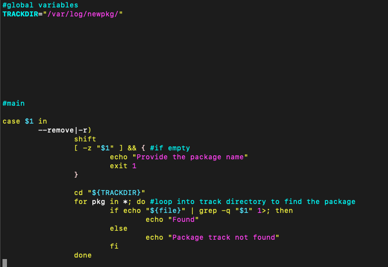

We can test if it can found the track files:

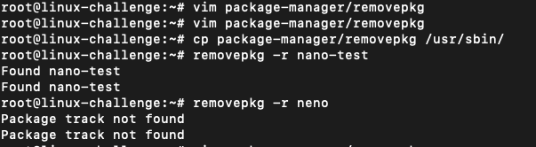

As we can see, for each loop it confirms if it ```grep``` the package. We must optimize this with a **flag***:


We proceed to create the REMOVE function, which will iterate over each file and delete it. We use ```unlink``` function to maintain it safe and avoid ```rm -rf``` command:

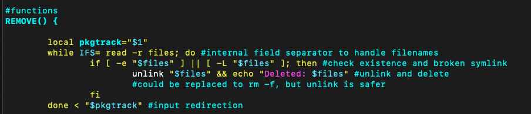


We test it:
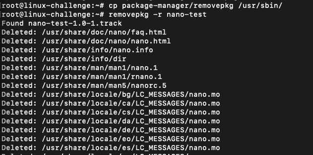

#### Fakeroot

We must add an option so the user is able to install a package outside root directory, as we done previously. To that, we add a new parser ```--fake``` :

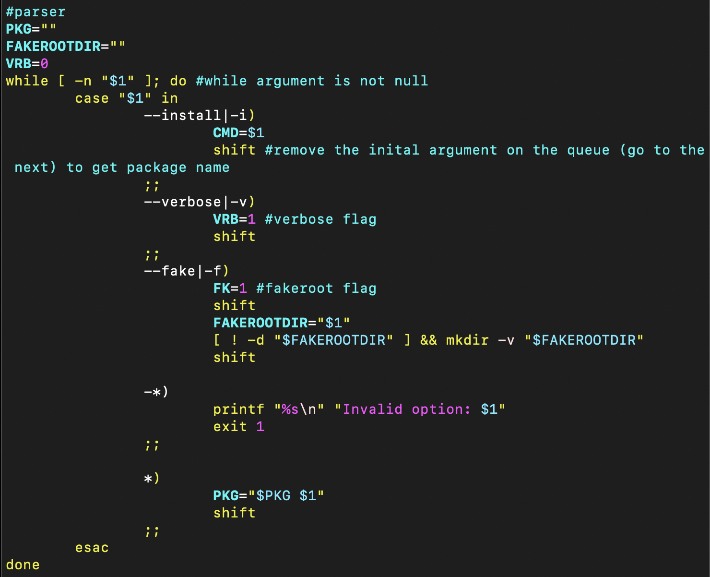

We validate it to ```/tmp``` directory:

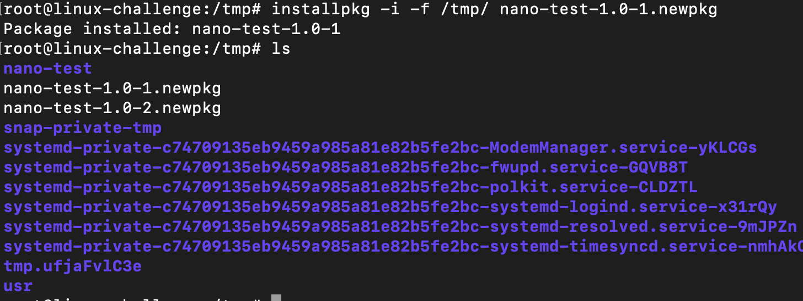


