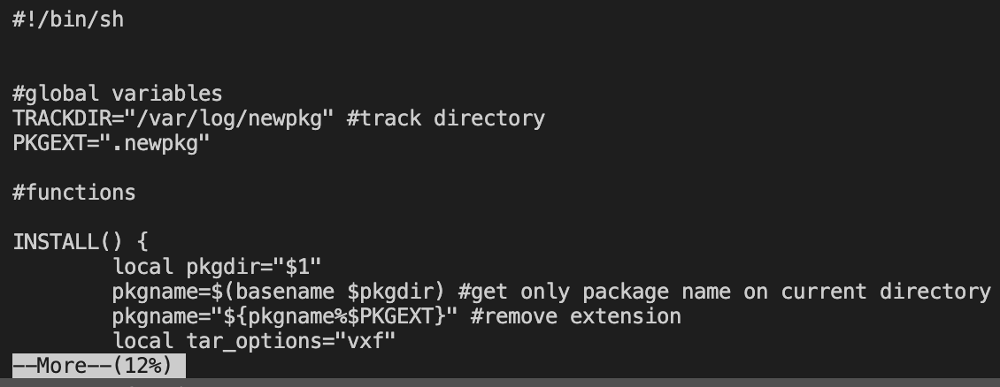
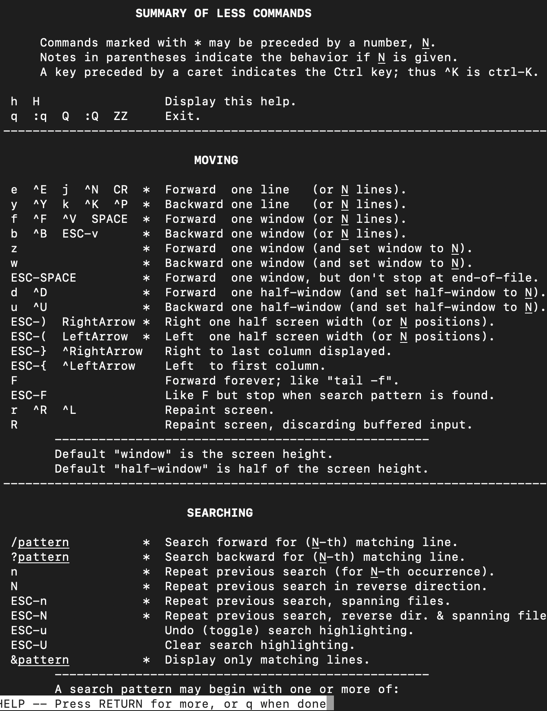
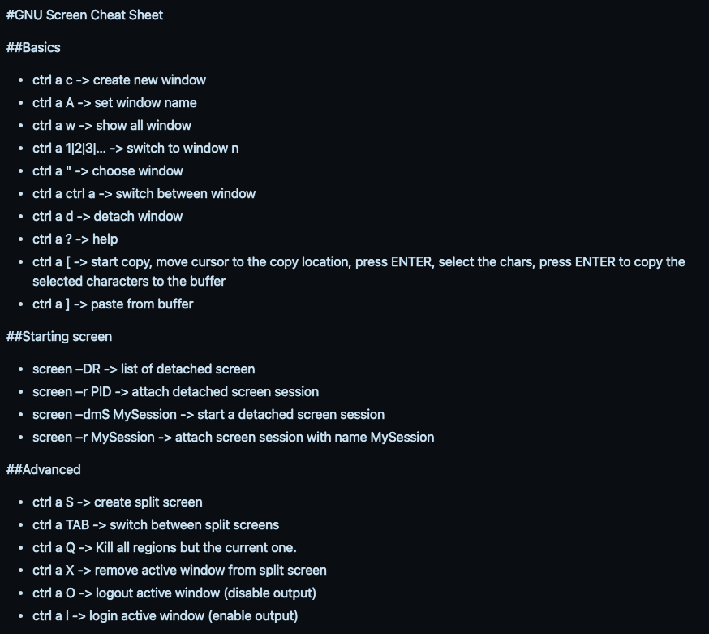
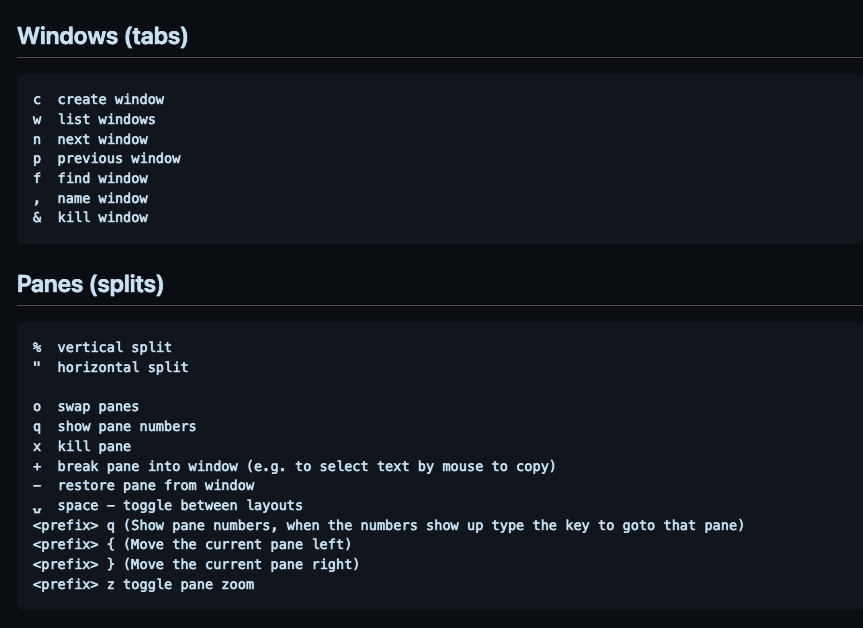

# More or less

We are somewhat familiar with command, history and reading manipulation on Linux!

Let's get some examples.

## More

It allows to page through a file and scroll it with ***Escape*** command:



When press ***h***, we can view all the options when reading a file:



Cool that shows a summary for ```less```command, as like it was extended to the ```more```command!

## Less

The opposite of more, it is optimized in a way that it does not need to load all the file to start reading it.

By typing ```b```, it can go backwards to the file.
With:
```bash
less +G file
```
It opens in the end, as it would be with ```G``` pressed when paging with ```more``` or ```less```.


## Terminal multiplexer

If we want to handle multiple terminals, we would wish to use commands to open ```tty``` easily.

We have ```screen``` and the well-known ```tmux```.

### Screen

It is simpler than ```tmux``` to provide window manager, but it is present on most of Unix systems.
We can start a named session with:
```bash
screen -S first-session
```

To return to it:
```bash
screen -r
```

To the new created session:
```screen
screen -r first-session
```

Surely, there is shortcuts to it:
```bash
(Ctrl+a) + d: #detach session
(Ctrl+a) + c: #create session
(Ctrl+a) + n: #next session
(Ctrl+a) + p: #previous session
(Ctrl+a) + ": #list sessions
```

For a extensive one, we have a [cheat sheet](https://gist.github.com/fredrick/1216878):




### Tmux

In other hand, we will alter the command prefix to ```(Ctrl+b)```. We will see how much powerful it is:
```bash
tmux #create session
tmux new -s first-session #create a named session
tmux ls #list sessions
tmux attach #last session
tmux attach -t second-session #attach to a named session
```

The shortcuts:
```bash
(Ctrl+b) + d #detach session
(Ctrl+b) + c #new session
(Ctrl+b) + n #next session
(Ctrl+b) + p #previous session
(Ctrl+b) + w #list sessions
```

Again, to the [cheat sheet](https://gist.github.com/MohamedAlaa/2961058)



It can manage the panes all by yourself!

```bash
(Ctrl+b) + -> #to the right
(Ctrl+b) + <- #to the left
...and so on
```