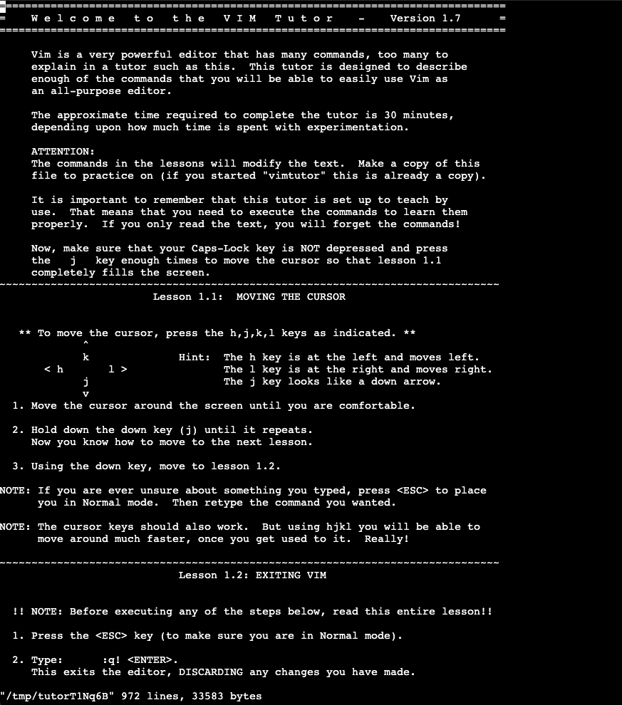

# Editing with **vim**

We will learn more about **vim** with ```vimtutor```.
For our tests, we will copy ```services``` file:

```bash
cp -v \etc\services test
```


## vimtutor

We can type ```vimtutor``` on the command line to start:



Recommend so much passing by all these lessons in order to manipulate and combine shorcuts, including on **Normal mode!**. So much to do with it!


Commands to test:
* dd: delete the line and copy it
* dw: delete word and copy it
* yy: copy line
* yw: copy word on cursor
* y$: copy from cursor until end of line
* p: paste
* u: undo
* u: undo changes on a line
* x: erase current cursor
* r + <character>: replace character with <character>
* Ctrl + r: redo
* o: new line below and enters insert mode
* O: new line above and enters insert mode
* cc: change line (erase line and enter insert mode)
* cw: change word (erase word and enter insert mode)
* v: enters visual mode
* Esc: back to normal mode
* i: enters insert mode
* <: backtab line
* >: tab line
* .: repeat last command
* ZZ: save and quit (:wq)
* ZQ: quit without saving (:q!)

Navigation:
* w: beginning of the next word
* b: beginning of the previous word
* e: end of current word
* 0: beginning of current line
* $: end of current line
* gg: first line of the file
* G: last line of the file
* Ctrl + g: show current location on the file
* Ctrl + f: forward
* Ctrl + b: backward

Editing:
* A: append to the end (go to the end of the line and enters insert mode)
* a: append to the next (go to the side cursor and enters intert mode)

```Ctrl+g``` in action:


Matching:

To search into the file, the character ```/``` is used.
Some features:
* ?: to search backwards
* %: next occurence of the character
* :/s/old/new/g: replace occurence on the LINE just as ```sed``` would do
For whole file: ```:%s/old/new/g```
To prompt for every occurence: ```%s/old/new/gc```
OBS: Separator can be , or ;

Commands:

To execute any command, type ```:!<command>```.
If I type it while reading, it prompts to continue:


