# The server and its services

We will manage an web server (Apache2 - *httpd*).
Let's start installing it:

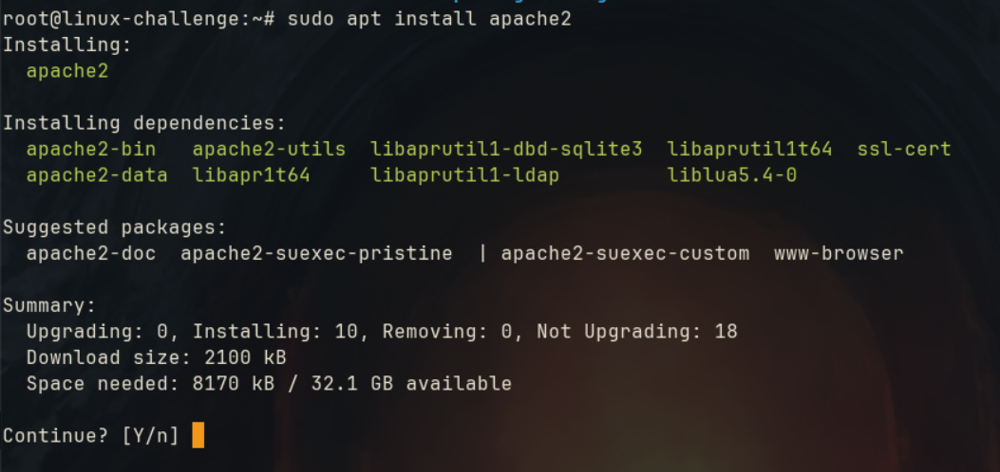

Checking if it is active:

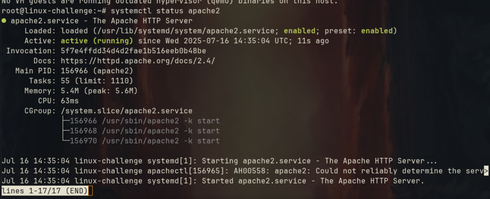

  Configuration is handled on vast majority at ```\etc``` folder:

  ```bash
  vim /etc/apache2/apache2.conf
  ```

We can check all the conf files included:

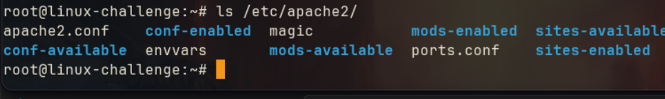


On browser, we insert the public IP for the VPS and port 80:

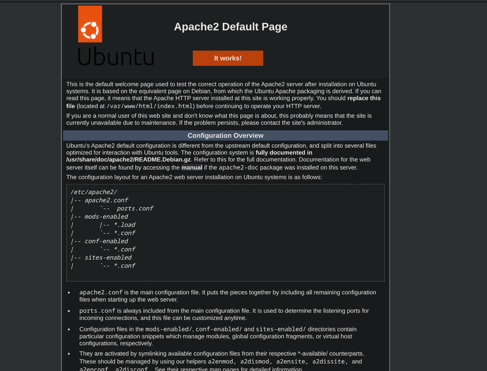

## Configuration

Based upon [TechHut tutorial](https://techhut.tv/how-to-apache-webserver-ssl/), we configure some steps on our web server.

### Hosts

Let's give our instance a hostname:

```bash
vim /etc/hostname #to install a hostname to be used
vim /etc/hosts #to attach a hostname to an address
```

Step by step:
* We give our system the hostname ```linux-challenge``` on ```etc/hostname```
* We attach to our localhost the same hostname

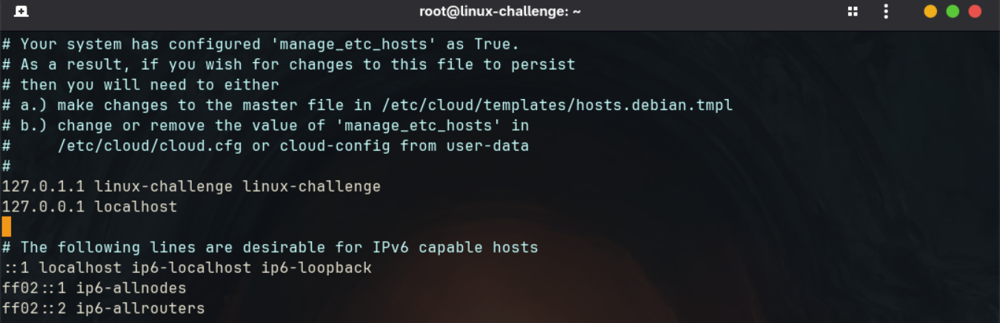

### Website

On ```/etc/apache2/sites-enabled/```, we have our *000-default.conf* that manages the website that shows up. At it, we have some configuration parameters:

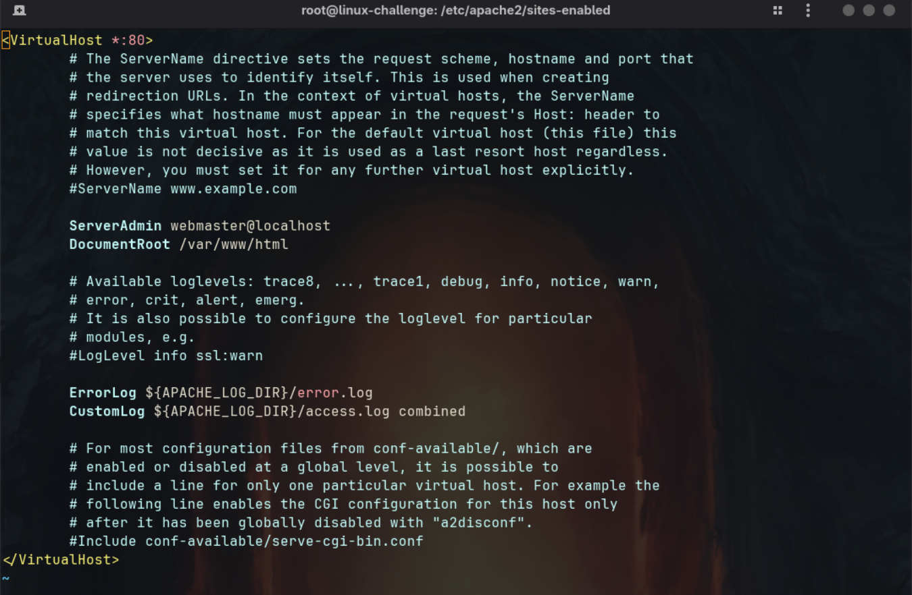

At ```/var/www/html/``` directory, we create a example website to take over the default:

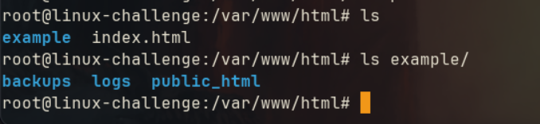

At ```/etc/apache2/sites-available```, we create a ```example.conf``` to include our new website:

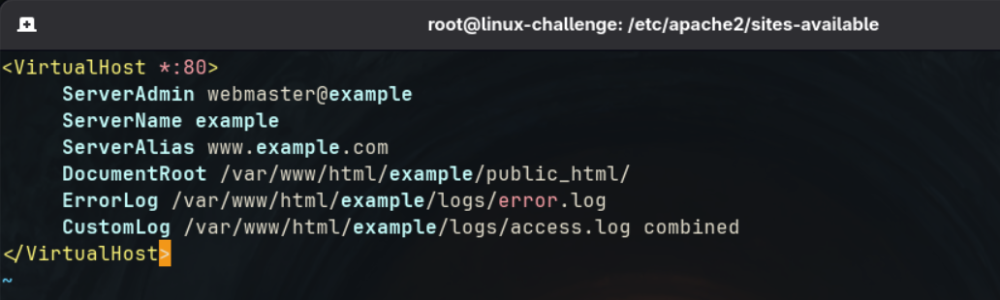

Finally, we enable this site with ```ae2ensite``` command. Otherwise, we could use ```ae2dissite``` to disable:

```bash
a2ensite example
```

### Security

Let's install SSL certificates on our web server. In summary, it creates an encrypted link between the server and the browser.

We must install the ```certbot``` and link it to our Apache instance:

```bash
apt install certbot python3-certbot-apache
```

Then, we attach it to our localhost:
```bash
certbot --apache -d example.com
#-d stands for domain
```

## SadServers "Cape Town"

*There's an Nginx web server installed and managed by systemd. Running curl -I 127.0.0.1:80 returns curl: (7) Failed to connect to localhost port 80: Connection refused , fix it so when you curl you get the default Nginx page.*

We first get the process status with ```systemctl```:


From the logs, we see that the ```/etc/nginx/nginx.conf``` has failed. Let's take a look:

On it, we see that it maintains a log for errors:

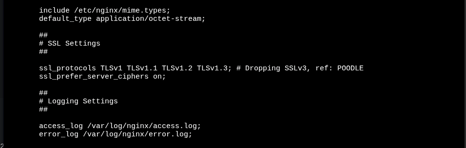

A possible culprit has been found, a character unexpected on ```sites-enabled``` file:

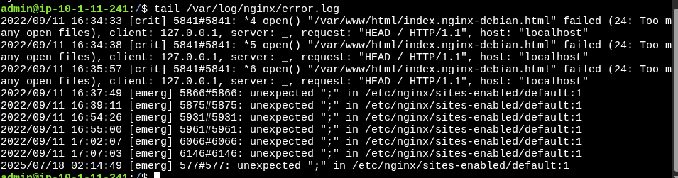

The first line has a **;**, let's remove it and restart the service:


Restarting:

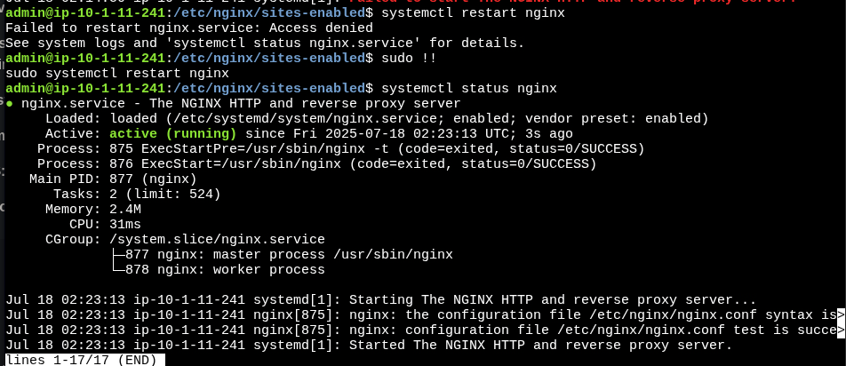

From curl, it gives code 500 - Server Error. We still need to investigate.

After some trials, I was unable to find it. It looks like the server is not handling concurrent connections:

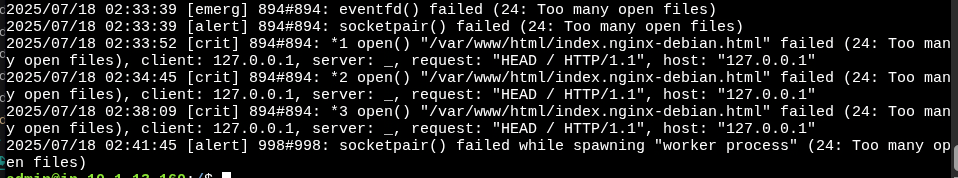

So, the solution was residing a line called ```worker_rlimit_nofile``` at nging.conf:

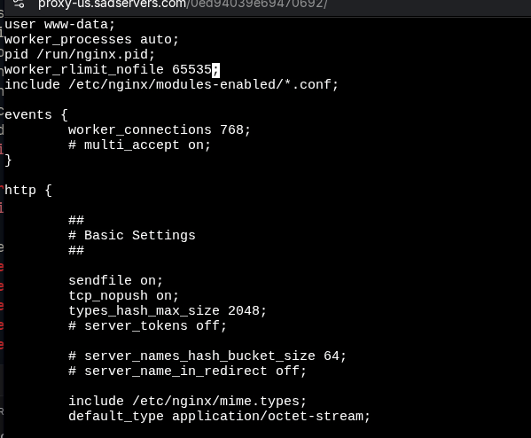

In its documentation, we can observe that it indicates how many open files a worker process can have:

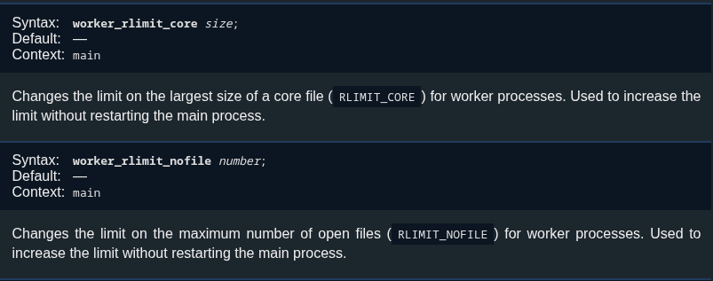


