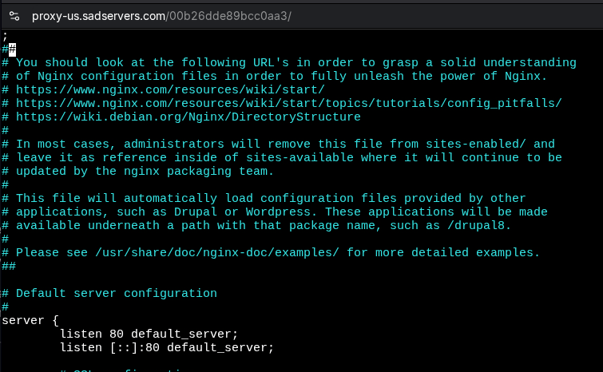

# The server and its services

We will manage an web server (Apache2 - *httpd*).
Let's start installing it:


Checking if it is active:


  Configuration is handled on vast majority at ```\etc``` folder:

  ```bash
  vim /etc/apache2/apache2.conf
  ```

We can check all the conf files included:


On browser, we insert the public IP for the VPS and port 80:


## Configuration

Based upon [TechHut tutorial](https://techhut.tv/how-to-apache-webserver-ssl/), we configure some steps on our web server.

### Hosts

Let's give our instance a hostname:

```bash
vim /etc/hostname #to install a hostname to be used
vim /etc/hosts #to attach a hostname to an address
```

Step by step:
* We give our system the hostname ```linux-challenge``` on ```etc/hostname```
* We attach to our localhost the same hostname


### Website

On ```/etc/apache2/sites-enabled/```, we have our *000-default.conf* that manages the website that shows up. At it, we have some configuration parameters:


At ```/var/www/html/``` directory, we create a example website to take over the default:


At ```/etc/apache2/sites-available```, we create a ```example.conf``` to include our new website:


Finally, we enable this site with ```ae2ensite``` command. Otherwise, we could use ```ae2dissite``` to disable:

```bash
a2ensite example
```
#### LAMP

We will prepare our server with LAMP stack:
* Linux
* Apache
* MariaDB (or MySQL)
* PHP

Firsly, we install MariaDB:
```bash
apt install mariadb-server
```

Furthermore, we initiate a script for the first security steps into our database:

```bash
mariadb-install-db #configuration databases
mariadb-secure-installation #security steps
```
An error has occurred to start InnoDB, the engine storage for MariaDB:


After some research, I have found that InnoDB buffer needs at leats 128Mb of RAM, and looks like we are without it...

After it, the MariaDB daemon was without permission to write, for it we changed the ```/var/lib/mysql``` owner to the ```mysql``` user:
```bash
chown mysql:mysql -R /var/lib/mysql
```

Then, we update the creation of files on ```/tmp```:
```bash
chmod 1777 /tmp
```

We get it running:


Finally, we install PHP:

```bash
sudo apt install apache2 libapache2-mod-php php-mysql php-mbstring php-xml php-curl php-gd php-intl php-zip
```
We add a ```test.php``` file into ```/var/www/html```:


We validate if PHP file is being recognized:


An user to the Wordpress application must be issued, also the database:

```bash
mariadb -u root -p password
```
Creation of user and database:


OBS: The command to define user is wrong:
```sql
GRANT ALL ON table.* TO 'user'@'domain' IDENTIFIED BY 'password';
```
Then we reload the configuration with:
```sql
FLUSH PRIVILEGES;
```

The Wordpress installation can begin:

```bash
curl -O https://wordpress.org/latest.tar.gz
tar xf latest.tar.gz
```
We move all the files inside ```wordpress``` directory to ```/var/www/html```:


Now we change the user and permission to all files and directories related:

```bash
chown -R www-data:www-data /var/www/html/
find . -type f -exec chmod 640 {} /;
find . -type d -exec chmod 750 {} /;
```
We have to configure our database name, username and hostname on ```wp-config.php``` file:


Also, we need to request unique keys and salts to Wordpress API:
```bash
curl -s https://api.wordpress.org/secret-key/1.1/salt/
```
It provides security:
* Salts insert random strings on sensitive information before it gets hashed
* Security keys encrypt information exchanged from cookies

We have to paste it on the same file.
After all, it should work:


### Security

#### SSL

Let's install SSL certificates on our web server. In summary, it creates an encrypted link between the server and the browser.

We must install the ```certbot``` and link it to our Apache instance:

```bash
apt install certbot python3-certbot-apache
```

Then, we attach it to our localhost:
```bash
certbot --apache -d example.com
#-d stands for domain
```

It is valid for 3 months. To automatizate it we can create a script to revalidate the certificate via ```cron```.

The [site](https://crontab.guru/) help us to define the period to run the script. For us, we choose:
* 0 0 1 * *: every first day of the month


After ```crontab -e```, we type the script:


#### Apache vulnerabilities

By default, Apache delivers so much information to the user that can be used as an exploit.
For a simple ```wget``` command, we can check it:
```bash
wget --server-response --spider ip-address
```

With this, we already can grasp the Apache version and the host OS.
To avoid that, we alter ```/etc/apache2/conf-avaialble/security.conf```.
We set *ServerTokens* to Prod:


Now the OS is not explicit. To the version, we set *ServerSignature* to Off:


We also remove the permission to the user see the tree of files on index neither symlinks:


OBS: Just -Indexes and -Symlinks would be able to do that

## SadServers "Cape Town"

*There's an Nginx web server installed and managed by systemd. Running curl -I 127.0.0.1:80 returns curl: (7) Failed to connect to localhost port 80: Connection refused , fix it so when you curl you get the default Nginx page.*

We first get the process status with ```systemctl```:


From the logs, we see that the ```/etc/nginx/nginx.conf``` has failed. Let's take a look:

On it, we see that it maintains a log for errors:


A possible culprit has been found, a character unexpected on ```sites-enabled``` file:


The first line has a **;**, let's remove it and restart the service:



Restarting:


From curl, it gives code 500 - Server Error. We still need to investigate.

After some trials, I was unable to find it. It looks like the server is not handling concurrent connections:


So, the solution was residing a line called ```worker_rlimit_nofile``` at nging.conf:


In its documentation, we can observe that it indicates how many open files a worker process can have:


