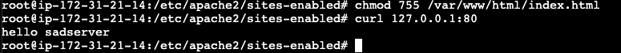

# Diving into networking

We have essential services running - *sshd* and *httpd* on ports 22 and 80 respectively.

We need to secure these with firewall.


We start checking the current open sockets with ```ss```:


To limit to only listening ports:

```bash
ss -l
```

Moreover, for only TCP connections:

```bash
ss -t
```

Same for UDP if we want only listening ports:

```bash
ss -ul
```

We can also check IPv4 connections:

```bash
ss -4
```


It has opened DNS, SSH and HTTP ports. Another way to do this is scanning our own server with ```nmap```:


## Firewall

The kernel has a bult-in framework called **netfilter** for packet filtering, NAT and other networking related operations. It has hooks exposed so programs can use these operations to query and configure.

The low-level utility is ```iptables``` and the newer ```nftables``` are the most complex interfaces to manage netfilter. We will start using ```ufw``` as it is more friendly.

Let's list our current policies:

```bash
iptables -L
```

As we would expect, none has been defined:


We will create some simple rules to test the ufw syntax:

```bash
ufw status
ufw allow
ufw deny
ufw enable
ufw reload
```

Beforehand, we allow SSH connections but deny HTTP for inband and outband traffic:


We cannot access the Apache server anymore:


We enable HTTP and regain access on web to the server. To just limit it for outgoing/ingoing traffic, we must explicit it:

```bash
ufw allow in http
ufw allow out http
```

Moreover, we can allow just a port and its protocol:
```bash
ufw allow 80/tcp
```

If not defined, UDP will be the default.
We can limit the access to a port to avoid brute force attacks:

```bash
ufw limit ssh/tcp
```

For default, it monitors for 6 attemps within 30 seconds.
To let the sender know that it has been denied, use:
```bash
ufw reject auth
```

To log each rule matching:
```bash
ufw allow log 22/tcp
```

To reset all rules states:
```bash
ufw reset
```

For IP addressing limitation, we can define it:
```bash
ufw allow from 1.1.1.1 to any port 22
```

In other words, only host 1.1.1.1 can SSH the server.


## SadServers

Put into practice into lab environments

### Tokyo: can't serve web file

*There's a web server serving a file /var/www/html/index.html with content "hello sadserver" but when we try to check it locally with an HTTP client like curl 127.0.0.1:80, nothing is returned. This scenario is not about the particular web server configuration and you only need to have general knowledge about how web servers work.*

At first glance, we try ```curl``` and check which ports are open with ```ss -lt```:


A strange role **http-alt** is placed. From iptables:


The policy drop any traffic towards HTTP. We list it as numbers and delete the policy:

```bash
iptables -D INPUT 1
```


We are able to ```curl``` now. However we still receive Forbidden code:


The server is unable to operate this file ```ìndex.html```. We change its permission: 



And it curls now.

### Taipei: Come a-knocking

*There is a web server on port :80 protected with Port Knocking. Find the one "knock" needed (sending a SYN to a single port, not a sequence) so you can curl localhost.*

Port knocking is a method of starting connecitons with servers ports, the sequence of trials can open a port that was blocked by the firewall.

We check if the port is listening:


We do ```nmap``` to knock our own ports:

```bash
nmap -Pn localhost
```

It has knocked port 80 and opened it.

