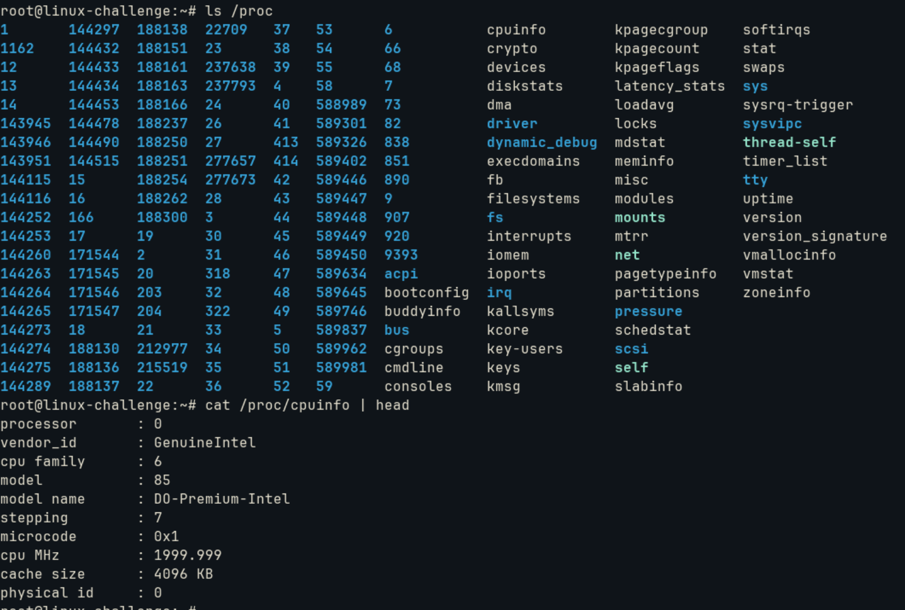

# Determine and Configure Hardware

## Device files intro

For an user with experience, it is a common sense that the startup for a compute follows the BIOS, bootloader and then the OS.

The BIOS stands for the motherboard firmware, and it is there where **device activation** is done. The old BIOS needed and MBR (Master Boot Record) at the first sector of the first partition. Nowadays, the UEFI needs an EFI System Partition (ESP) and uses FAT anywhere on the partition, with each bootloader registered. A curiosity:
* BIOS firmware is in 16-bit Assembly lang
* UEFI firmware is in 64-bit C lang

The **device inspection** is performed after boot inside the operating system.

The hardware is handled by multiple interfaces, one of them is the Peripheral Component Interconnect (PCI), now called PCI Express (PCIe).
Back on time, we had PATA (Parallel ATA) which carries data from the drive and the mobo at the same time. However, in a much slower speed than SATA (Serial ATA), that now carries the data with bits sequentially.

On Linux, we can list all of these components:
```bash
lspci #list PCI devices
lsusb #list USB devices
```

To get deeper info on a specific device, we must get his unique address (the first column):


And then:
```bash
lspci -s address -v
```


It shows the kernel driver in use for this device as well. In this case, ```virtio-pci```.
For ```lsusb```, we can do the same using the product ID from the vendor:
```bash
lspusb -d id -v
```


All above list devices that not certainly are operational. The kernel stores a bunch of modules/drivers that are loaded on demand. The ```kmod``` package provides tools to handle these, to list it all the active/loaded ones use ```lsmod```:


The *Used By* column shows the dependencies, in other words, the modules which are dependent with. The ```modprobe``` command can load/unload a specific module. 

To load:
```bash
modprobe module
```
And to unload:
```bash
modprobe -r module
```

The ```modinfo``` can show more about the module:


Through ```/etc/modprobe.d/*.conf``` we can blacklist a module to be loaded, or be preferred.


## Storage devices

Storage can be classified on how it manages data:
* Block: read to and from in blocks/chunks of buffered data from different sizes and positions (hard drives)
* Character: read to and from in data streams/characters without a specific size (printers)
* Pipe: like character devices with another process managed at the end of the I/O instead of a kernel driver (device has its own driver managed itself)
* Socket: interface for interprocess communication outside ```/dev``` directory


Most storage devices are now identified as SCSI devices, protocol that leverages special busses in parallel. We can get some info with ```lsscsi``` command:
```bash
lsscsi
[N:0:0:1]    disk    YSSDHB-1TN7000__1                          /dev/nvme0n1
[N:1:1:1]    disk    ADATA LEGEND 710__1                        /dev/nvme1n1
```

The first column identifies the device address, the second describes its kind and the last indicates where to find the device file.

## dd

When working with block and character devices, the command ```dd``` is useful. Its function is to read from an input file or stream and write to an output file or stream. It accepts manipulation like encoding and conversion.
Example:
```bash
dd if=/dev/zero of=new_file bs=1024 count=1
```
It copies a single 1024 byte block from /dev/zero and writes it on new_file.
* if: input file
* of: output file
* bs: block size
* count: how many blocks to copy
* skip: how many first blocks to skip

## Abstraction

The commands mentioned above are just front-end for hardware information found on specific directories on Linux. These directories (or pseudo-filesystems) are mount points to filesystems not present in a device partition, but **only in RAM where it has runtime storage configuration and information for the kernel**. These filesystems are ```/sys```, ```/proc``` and ```/dev```.

For example, for the Ethernet controller we would have a bunch of information maintained on directories at ```sysfs```:


For hardware inspection, we can use ```/proc```:



OBS1: ```/dev``` file enables user processes to use the device, ```/sys``` file provides an interface for hardware info primarily for programs

OBS2: ```/sys``` has primary function to store device information and kernel hardware data, while ```/proc``` includes running processes


## Device file creation

We can manually create a device file, but it is not common since ```devtmpfs``` and ```udev``` handles all. For it:
```bash
mknod /dev/sda1 b 8 1
```

The command explicits a SCSI device(HD or SSD) as a block device(c for character, p for pipe and s for socket) and the major and minor number for kernel addressing(8 for SATA/SCSI disk driver and 1 to refer the disk driver for identification).


## udev and devtmpfs

As seen above, we can create device files at user space already. Why should we concern at kernel level?

The kernel send notifications to user-space proccess called ```udevd``` upon detecting a new device on system. It creates automatically a device file and perform its initialization. But how it does on boot?

Moreover, and if the device is a dependency for other parts of the system to intialize? The ```udev``` daemon resides on user space, so the filesystem must be mount!

An old solution was to initialize a mini version of udev in RAM with ```initramfs``` to create necessary devices and mount the root filesystem. However, not scalable.

Then appears the ```devtmpfs```!

It was created just for the problem of device availability during boot. It is based on the older version ```devfs```, which function was to outline static ```/dev``` mainteinance with MAKEDEV program and keeps at kernel space the implementation of ```/dev``` with all the devices the kernel current support.
The drawback is visible, it creates device files for every loaded driver even if it was not operational or even initialized.

The ```devtmpfs``` proposes a simplified way while creating device files on demand in **RAM**. It operates as a mechanism by identifying and **creating** device files, then the ```udevd``` is notified for permissions, ownership and symlinks creation. The steps go:
* system starts
* POST for device check
* bootloader and initramfs image creation
* devtmpfs creation for any new device identification
* kernel mounts initramfs as its temporary root filesystem and ```/dev``` is delivered by devtmpfs
* minimal udevd starts to scan and apply policies on the new device files
* perform switch root to the main init system, usually ```systemd```

We can check the syslinks created by udev. It resides at ```/dev/disk/by-uuid``` and ```/dev/disk/by-label```


And when we insert devices if the system already up?

The ```udevd``` is already up, it waits for notifications called ```uevent``` through an internal network link(netlink socket, to avoid writing into a file). It loades the attributes(vendor ID, product ID, serial number...) and apply rules(placed at ```/etc/udev/rules.d``` and ```/lib/udev/rules.d``` for symlink creation and firmware load). We monitor uevents:
```bash
udevadm monitor
```

We query the properties with --property option. For example, I have inserted a USB drive:


We can see that it has attributes for sysfs path, /dev path and IDs. We can query already loaded devices:
```bash
udevadm info --query=all --nam=/dev/sda
```

It gaves the symlinks and the attributes.


## SCSI concepts

SCSI is a set of standards to transfer data between hosts and peripheral devices. Its traditional setup is a host adapter linked with a chain of devices over a SCSI bus:


Each device(**target**) is managed by its SCSI ID (8 or 16 bits long per bus) and can have sub-devices attached with a **Logical Unit Number(LUN)**. Any of them can communicate with each other and must go through the host adapter. The identification does as follows:
* SCSI host adapter
* SCSI bus number
* SCSI ID
* LUN


From this image, we see four host adapters (scsi0, ..., scsi3). For the scsi2, we have a SCSI ID 0 with 4 sub-devices. The communication at kernel level does as follows:


* the block device is handled by its driver being disk or CD
* this driver abstracts requests from kernel block device into SCSI commands
* the bridge handles hardware-specific actions to manage SCSI messages to specific host adapters (they vary on procedures)
* follows the driver related to the disk
    * SATA drives has an additional layer with **libata**  to act as a translator for ATA and SCSI messages

### Generic SCSI devices

In order to read and write to a SCSI device, a generic driver located on user-space can be used.

To list generic devices (pure SCSI devices):
```bash
lsscsi -g
```

It is an architectural choice in order to leave complexity from the kernel (stability and fault isolation). For example, write into CD/DVD disks has more burden than read:


A file ```/dev/sg1``` in user-space do the translation as would the bridge layer.
