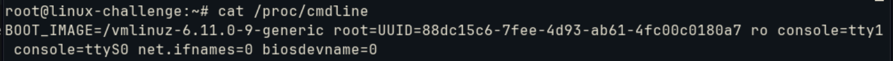
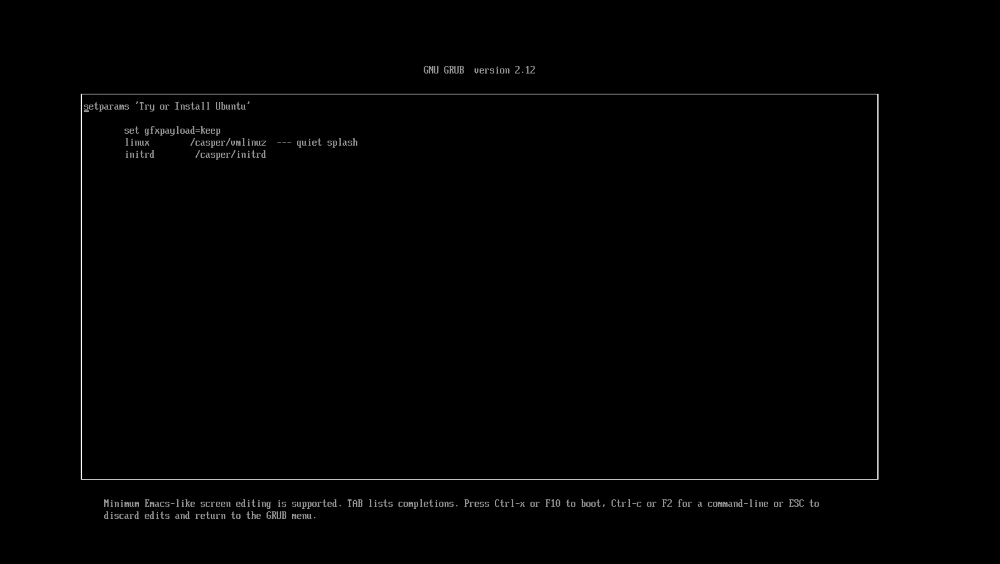
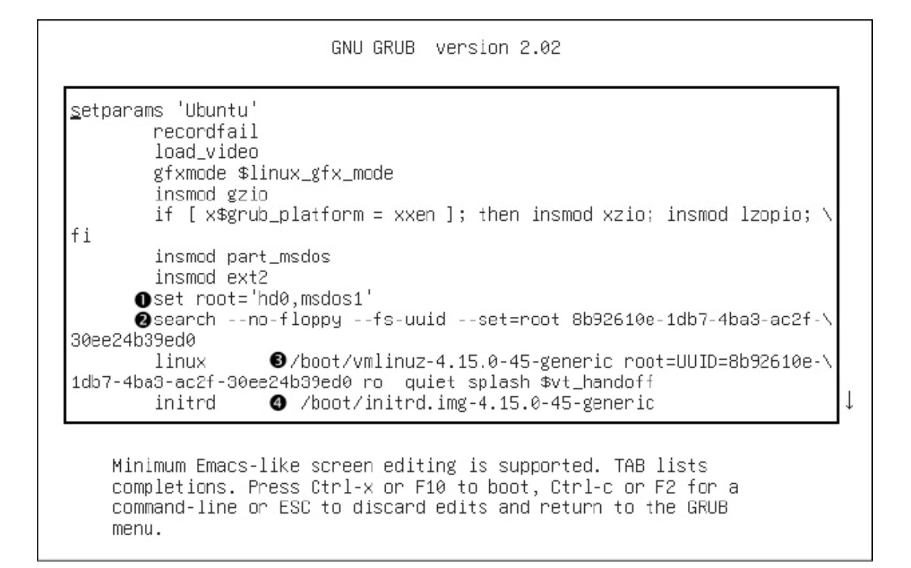
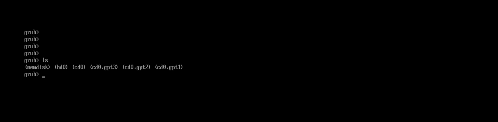
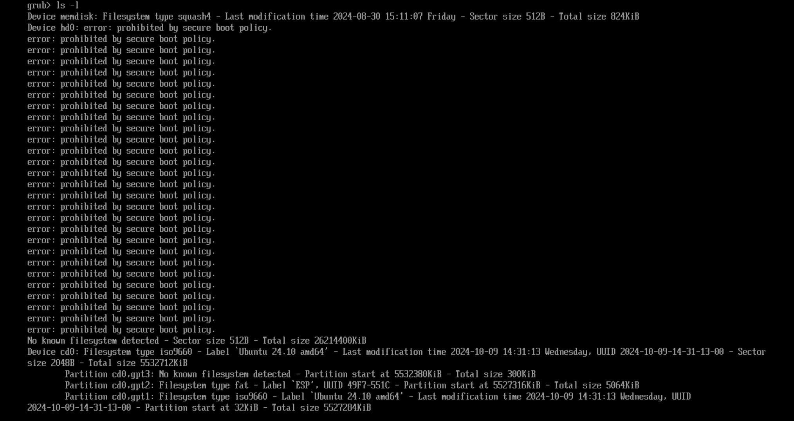
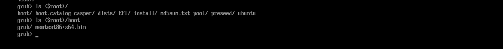

# Boot the system

From previous topic, we have already discussed about BIOS and UEFI functionality. Both are firmwares that handles device inspection and activation:
- POST to identify simple hardware failures
- activates basic components for the system
- load the bootloader (MBR in the first 440 bytes of the first device, or ESP partition defined in NVRAM)
- load kernel image into memory(```initramfs```) and starts it 
- kernel mounts the root filesystem
- initializes init process(system daemons and script initialization, normally ```system```) to start user space and its modules
- init sets the rest of the system

To read boot messages already in the system:
```bash
journalctl -b
dmesg #if the system is not systemd-based
```

OBS: ```dmesg``` consults the **kernel ring buffer** for the logs, which differs from a log file because it is stored in RAM and the messages overwrites as they are generated. That is why it can store syslog messages from its daemon

The most famous is GRUB(Grand Unified Bootloader) for Linux systems. A bunch of parameters is installed:
- ascpi
- init: system initiar (eg. /bin/bash)
- systemd.unit: target activation
- mem: available RAM
- quiet: hide boot messages
- vga: video mode
- root: root partiion
- rootflags: mount options
- ro: read-only permission
- rw: read and write permission

The configuration is handled on ```/etc/default/grub```. For kernel parameters we use the field ```GRUB_CMDLINE_LINUX``` and we can check it on ```/proc/cmdline```. To create a new configuration:
```bash
grub2-mkconfig -o /boot/grub/grub.cfg
```

## Kernel initialization

The kernel does at operational system level the following:
- CPU and memory inspection
- Device and bus discovery
- Subsystem setup (e.g networking)
- Root filesystem mount
- User space start


During kernel load, a set of parameters is used to define the amount of diagnostics output to produce as well device driver-specific options. To check the currently in use:
```bash
cat /proc/cmdline
```



We can arbitrarily select the root parameter as the most important, since it selects the filesystem UUID which the system will boot (it does not leverage kernel mapping (e.g ```/dev/sda```)).

The ```ro``` parameter builds the filesystem in read-only mode. Parameters not readable by the kernel are maintained to the init process. For introduction to available parameters:
```bash
man bootparam
```

For example, we can choose the beforemost initial command to be issued by the kernel with ```-init```.

### bootloader

An issue the bootloader must overcome is the capacity to locate the kernel and its parameters, which are most usually in kernel filesystem itself. For this, the BIOS/UEFI system must access disk and identify the kernel location, and obviously it must not depend on device files (since the kernel is not initialized yet).

For this, the firmware has a simple data access protocol called Logical Block Addressing (LBA). Afterwards, the data management uses SCSI and device files.

Fun fact: When pressing ```e``` on GRUB, we are able to check bootloader configuration



It can show more parameters, as shown:



A lot of commands appear, however how it is issued without the kernel loaded? Because **GRUB has its own binaries** that is very similar to the Linux. For example, ```insmod``` is like the one handled by ```udev``` to load modules.

It shows:
- Initial RAM filesystem located at /boot/initrd.img
- Modules for MSDOS and EXT2

The big questions resides on root nomenclature. For GRUB, it names the device from its OWN configuration, in this case ```hd0,msdos1```. Afterwards, it searches for a specific UUID partition and loads the kernel image file with the location specified. In the end, the initial RAM filesystem (```initrd```) is also specified. 

We can get into GRUB command line pressing ```c``` on boot:



From the first command, we see that it has the same list command ```ls```. The main disk is denoted as **cd0**. With ```ls -l``` we get details:



To check the root filesystem defined and the files inside its partition:




