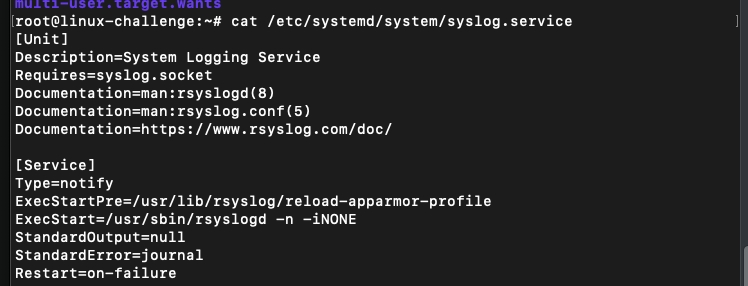
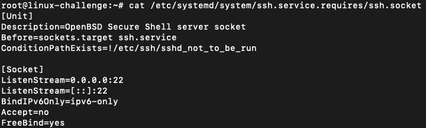

# Change runlevels/boot targets and shutdown or reboot system

With kernel in hands, how does the user space handles the system?
It follows an order:
- init process
- low-level services (udevd and syslogd)
- network
- other services (cron)
- GUIs


Let`s discuss step by step.

## init

As a process as any other program, it is located in ```/sbin```. From Linux history, it had a bunch of init candidates:

### SysVinit

Created by Red Hat, this service manager operates in states (called **runlevels**):
- runlevel 0: shutdown
- runlevel 1: single user mode, without network and non-essential capabilities
- runlevel 2,3 or 4: multi user mode, can login by console or network
- runlevel 5: multi user mode, plus GUI
- runlevel 6: restart

It is choosen by a kernel parameter or in ```/etc/inittab``` file, each runlevel has a script associated with it. For example, to the system to work on a 5 state(console without GUI) it will have an attached master script to it(e.g. ```/etc/rc.d/rc```). A configuration file example:

```yml
# The default runlevel.
id:3:initdefault:

# System initialization.
si::sysinit:/etc/rc.d/rc.sysinit

# What to do in each runlevel.
l0:0:wait:/etc/rc.d/rc 0
l1:1:wait:/etc/rc.d/rc 1
l2:2:wait:/etc/rc.d/rc 2
l3:3:wait:/etc/rc.d/rc 3
l4:4:wait:/etc/rc.d/rc 4
l5:5:wait:/etc/rc.d/rc 5
l6:6:wait:/etc/rc.d/rc 6

# What to do when CTRL-ALT-DELETE is pressed.
ca::ctrlaltdel:/sbin/shutdown -t3 -r now

# Run gettys in standard runlevels
1:2345:respawn:/sbin/mingetty tty1
2:2345:respawn:/sbin/mingetty tty2
``` 

In the runlevel file:

```bash
ls -l /etc/rc.d/rc3.d/
lrwxrwxrwx 1 root root 17 Aug 10 2024 K50netconsole -> ../init.d/netconsole
lrwxrwxrwx 1 root root 16 Aug 10 2024 S10network -> ../init.d/network
lrwxrwxrwx 1 root root 14 Aug 10 2024 S25sshd -> ../init.d/sshd
lrwxrwxrwx 1 root root 15 Aug 10 2024 S80httpd -> ../init.d/httpd
```

It tells to kill the ```netconsole``` process and start ```network```, ```sshd``` and ```httpd```.

To switch between runlevels:
```bash
sudo init 1 #or other runlevel
```

To check services:
```bash
sudo service httpd start
```

As we can see, one of the biggest flaws for SysVinit is that it starts services **sequentially**. Moreover, this sequence is solely based on the script nomenclature (e.g. S10 before S20).

## systemd

The modern init process propose:
- parallel service starting
- intelligent order of services initialization
- unified loggin instead of seggregation into /var/log

It works defining **units**, or goals for a system task. For classification:
- service units: daemons
- target units: control/group units
- socket units: inbound network connection request
- mount units: filesystems attachment

We can check the ```syslog.service``` unit under ```/etc/systemd/system/``` directory:



We can see that the Unit field contains description and details about the unit, in particular that it depends the *syslog.socket* unit (interprocess communication). For Service section we already have how to prepare, start and reload the service (AppArmor profile starts previously and then the binary for syslog).

OBS: Dependency is also called Wants, and there are specific files just for it

As an example, we can check the ```sshd.socket```:



To reload a unit:
```bash
systemctl reload unit
systemctl daemon-reload #all unit config
```

To list all units:
```bash
systemctl list-units
```

To check jobs (operations ongoing):
```bash
systemctl list-jobs
```

To stop and remove:
```bash
systemctl stop unit
systemctl disable unit
```

To keep track of a process, the systemd manages **cgroups**. A service could start and fork new instances or create a daemon of itself.

On startup, we can explicitly tell the service behavior within the Type field:
- simple: maintains on main service process
- forking: forks itself
- notify: notificates to systemd with a function call
- dbus: registers itslef on the d-bus


