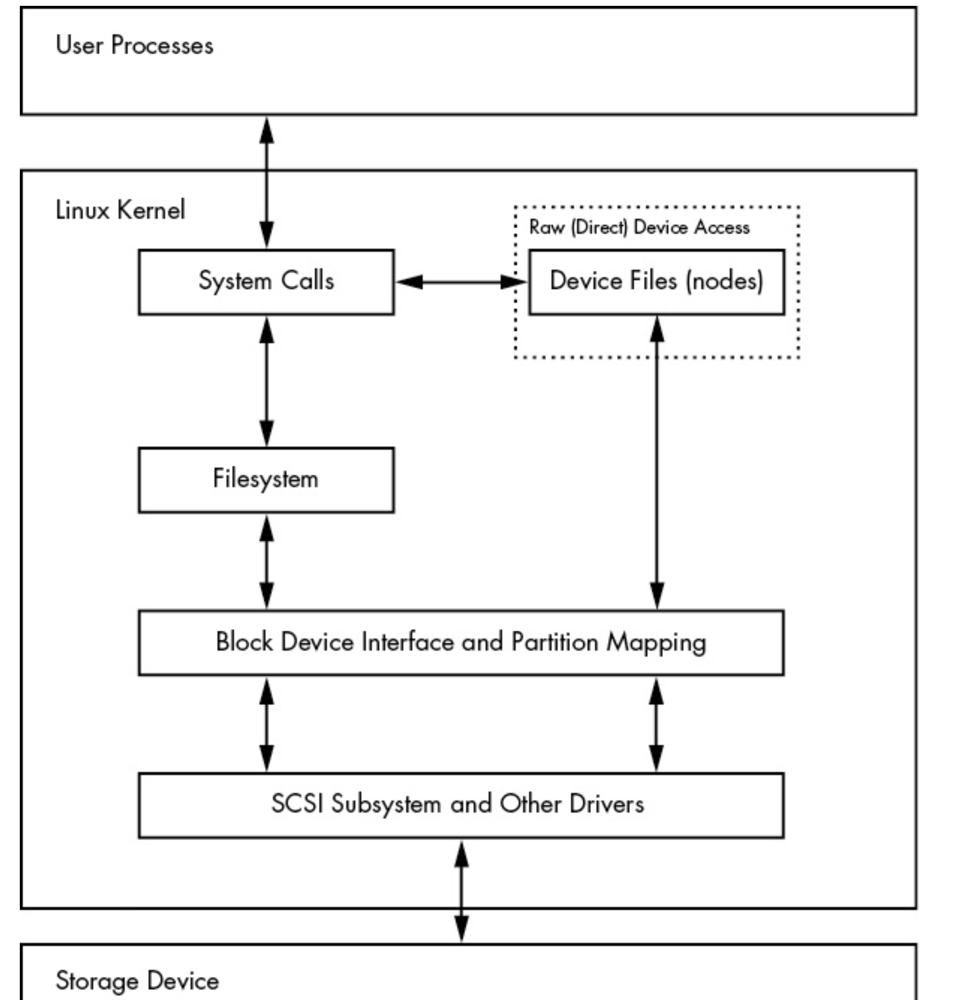
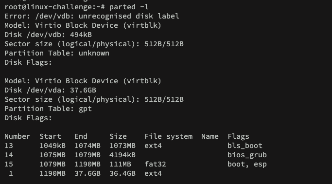
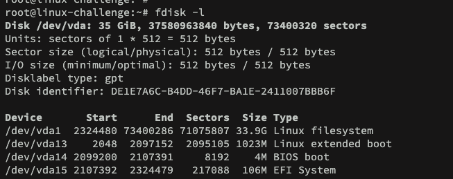

# Design hard disk layout

In this lesson we will dive deep into disks and filesystems.
As we know, the kernel makes possible to access an entire disk and one of its partition at the same time. This process would look:



The user uses the filesystem, a structured storage that we are used to, for disk access. Moreover, it uses SCSI as we previously learned to control in hardware layer.

To produce partitions, the common tools are ```parted``` for CLI, ```gparted``` for GUI and ```fdisk```. Both support mBR and GPT partition tables.

To check the actual partition appled:

```bash
parted -l
```



It is under GPT partition table as a virtual block disk. The ```parted``` command has a tricky size calculation, since it is approximated in a way it finds easiest to read. On other hand, ```fdisk -l``` shows it exactly:



It is based in 512-byte sectors, and it even shows the disk identifier.


