# Design hard disk layout

In this lesson we will dive deep into disks and filesystems.

## partition

As we know, the kernel makes possible to access an entire disk and one of its partition at the same time. This process would look:


The user uses the filesystem, a structured storage that we are used to, for disk access. Moreover, it uses SCSI as we previously learned to control in hardware layer.

To produce partitions, the common tools are ```parted``` for CLI, ```gparted``` for GUI and ```fdisk```. Both support mBR and GPT partition tables.

To check the actual partition applied:

```bash
parted -l
```


It is under GPT partition table as a virtual block disk. The ```parted``` command has a tricky size calculation, since it is approximated in a way it finds easiest to read. On other hand, ```fdisk -l``` shows it exactly:


It is based in 512-byte sectors, and it even shows the disk identifier.
OBS:
-  ```fdisk``` modifications are notified as system calls to the kernel
-  ```parted``` signals kernel when individual partitions are altered
- we can check modifications with kernel events via ```udevadm monitor --kernel```
- to force a partition table change like ```fdisk``` system call: ```blockdev -rereadpt /dev/sd_```
  

**Exercise:** We will manage a USB drive to perform modifications with ```fdisk```

First, we access the disk:
```bash
fdisk /dev/sda
```

It enters on interactive mode, some commands are shown with help utility:


To print the partition table:


OBS: Any modification can be recover with **q**(quit without saving)

To wipe out the partition and create a 200MB one (MBR-style partition table):


To write a 200MB first sector:


## filesystem

What the user interactes to is the filesystem. It is a form of database, structured to transform simple block device into a hierarchy of files and subdirectories.

To be used, it needs to be mounted. In other words, attach the filesystem to a specific point in system's directory tree (mount point). For example, new users are mounted under ```/home``` directory.

OBS: Mount point must exist before the filesystem to be mounted

Back in the day, filesystems were implemented in the kernel. However, a [new protocol](https://9fans.github.io/plan9port/man/man9/intro.html) manages the File System in User Space(FUSE).

**Quick look**: how user-space and kernel communicates with FUSE
- application tries to access a file under a standard syscall (```open()``` or ```read()```)
- kernel (virtual filesystem or LFS) receives it and check the mount point as FUSE and passes it to the kernel module
- now in user-space, the driver process acts as a 9P client to translate into the protocol (```Twalk``` to navigate into the directory tree, ```Topen``` to open the file and ```Tread``` to read)
- it is sent over the network or a local socket to the 9P server
- the server responds(```Rread``` to get file's data) and send it back to the FUSE driver
- it passes to the kernel module and it extracts to the application


Types:

- ext4 (simplicity and maturity): successor of ext2 after cache was added to ext3 to enhance data integrity and hasten booting (speed up startup process), it supportts larger files and greater number of subdictories.
- btrfs (snapshots and data correction): instead of overwriting data in place, it writes a modified copy to a new location (copy-on-write), it has built-in support for snapshots, subvolumes, RAID and uses checksums for data and metadata correlation for correction
- fat (microsoft): vfat (up to 4GB) or exfat (4GB and up) partitions by default used solely for windows (that now supports ntfs)
- xfs (performance with large files and dynamic allocation): the filesystem capable to handle the largest files (up to 8 exbibytes!), it is optimized for large sequential I/O operations (streaming, large databases...) and allocate dynamically space and inodes
- zfs (data integrity and own RAID implementation): it has a primary focus on preventing data corruption with 256-bit checksum and copy-on-write nature

OBS: The ext4 and xfs are **journaling** filesystems, in other words it protects against data corruption by keeping a log(a journal cache) for changes to be made to the disk.

To troubleshoot a corrupted disk, we flush the journal which is inconsistent with the actual data. First we mount it as ext2(ext3 and ext4 does not allow to mount it with a nonempty journal):
```bash
mount -t ext2 /dev/sda mountpoint
efsck -fy /dev/sda #f for flush and y for yes
```


To create a filesystem in a disk:

```bash
mkfs -t/--type ext4 /dev/sda
#or
mkfs.ext4 /dev/sda
```

It determines the number of blocks a reasonable defaults.
To mount it, we must provide:
* filesystem device
* filesystem type
* mount point

Manually:
```bash
mount -t/--type ext4 /dev/sda mountpoint
```


Normally the type is automatically detected, so no need to provide it. To unmount(detach):
```bash
umount mountpoint
```

The options could be general or filesystems-specifid:
* -r: read-only mode
* -n: do not update system runtime mount database(```/etc/mtab```)
* -o: specify long options, like ro,uid,noexec,remount, etc...

As we know, a disk is managed by its UUID (```udev``` and ```devtmpfs```) and represented to it via symlinks. When it is mounted, it does no different: it creates a UUID and initialize the filesystem data structure. To get all UUIDs per disk (can be called serial numbers):
```bash
blkid
```


It is visible a VFAT and EXT4 partitions. We could mount based upon the UUID:
```bash
mount UUID=2025-07-02-20-57-26-00 /home/extra
```

### /etc/fstab

The system keeps a list of filesystems and options in ```/etc/fstab```, named filesystem table. It is maintaned as a plain text and we can check:


We can see the label/UUID, the mount point, the filesystem type, options, backup info(always set to 0) and the filesystem integrity test order(```fsck``` to check for 1 if root, 2 for other and 0 for disable - in this example the disk for boot is set as other).

To health check a particular UNMOUNTED disk (or it is on read-only mode):
```bash
fsck /dev/sda
```

To automatically fixes ordinary problems:
```bash
fsck -p /dev/sda
#or for all disks
fsck -a 
```

We can run it without modifying any data:
```bash
fsck -n
```


If the filesystem was not automatically mounted:
```bash
mount -a/--all
```

It mounts every entry from fstab(filesystem table).
OBS: 
* The **defaults** mount options set read-write mode, enable device files, executables, setuid(per user)...
* The **noauto** tells to the system to not automatically mounts the filesystem in boot time
* The **errors** sets the kernel behavior when it fails to mount the filesystem, the common ones are *errors=continue*, *errors=panic* and *errors=remount-ro*(remount as read-only)
* The **user** indicates that unprivileged users can mount on this particular entry


### special filesystems

In Linux, we have some important filesystems:
- proc (/proc) mounts processes information into each file
- sysfs (/sys) for attached devices
- tmpfs (/run) to use memory as temporary storage
- squashfs as a read-only filesystem where content is stored in a compressed format and extracted on demand
- overlay that merges directories into a composite by creating layers for each directory (lowerdir and upperdir), for example when managing containers the system creates multiple read-only lowerdir layers and the node only writes into the upperdir

## logical volume manager (LVM)

When defining partitions, it is done once before populating it. We have little administration on how it is distributed, expanded, shrinked afterwards. The LVM allows such flexibility with a virtualization layer between the disk and the filesystem:
- the disk is called physical volume (PV)
- PVs are grouped into volume groups (VGs) which abstracts the underlying devices, seen as a single logical device (pool)
  - normally the systems have one PV and two **logical volumes** (into a single volume group, like partitions) for root and swap
  - it is subdivided into fixed-sized pieces called extents (4MB by default)
  
  

To add size, extents are placed into the pool. The operations that LVM handles are:
- add move PVs to a VG, increasing its size
- remove PVs as long there is enough space for the data
- resize logical volumes (in other words resize filesystems with ```fsadm```)

There are individual commands to manage LVM, which are just symbolic disks.
To show volume groups:
```bash
vgs #stands for volume group summary
```

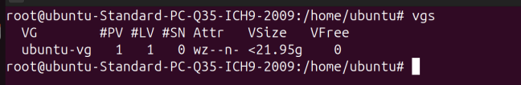

The first column is the volume group name, following the number of physical volumes, logical volumes and snapshots attached. The Attr represents the status attributes (*w* for writeable, *z* for resizable and *n* for normal allocation policy), the VSize represents the volume size and VFree is the amount of unallocated space.

To get into its properties:
```bash
vgdisplay
```
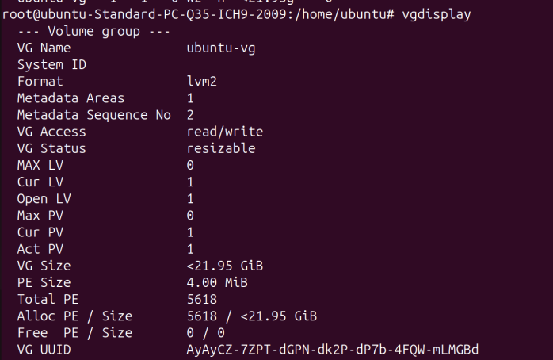

Here we can get the attributes, the extent size (4MB) and its total (2559), the logical volumes in use (Open LV) and even the volume group UUID.

To check the logical volumes:

```bash
lvs
```

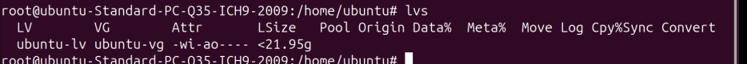

It contains the logical volume name, the volume group associated, its attributes and its size. Similarly, it has a detailed command:
```bash
lvdisplay
```

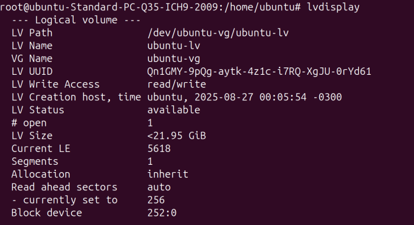

We only have one logical volume because the swap partition was not configured. On this command, we see that the logical volume also has UUID, a path into ```/dev``` directory. However, it is not the definitive mount point:

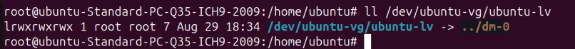

The LVM actually creates block devices under ```/dev/dm-*```, since its unpredictability the symbolic links are created. 

For physical volumes:

```bash
pvs
pvdisplay
```

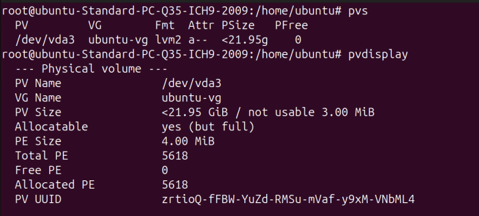

The physical volume name is actually it is actually the block device under ```/dev/vda*```. The attribute *a* allows it to be allocatable.

### Constructing a LVM

We will use 2x16GB USBs drives to construct a LVM. First, unmount it all:
```bash
#USB1
umount /media/ubuntu/ESD-USB/
#USB2
umount /media/ubuntu/ESD-USB1/
```

Now it is time to create a partition on each for LVM:
```bash
fdisk /dev/sda
```

We add type ID *8e* for the partition:
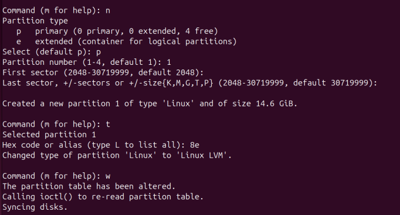

For the second disk, we only allocate 5GB for LVM:
```bash
fdisk /dev/sdb
```

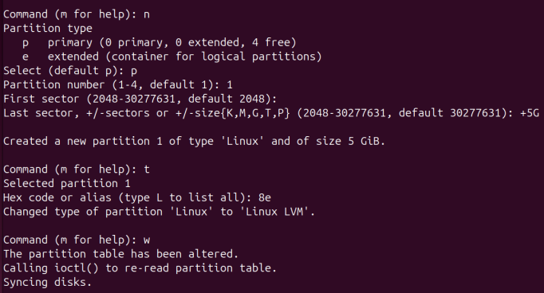

We check if it was successfully created:

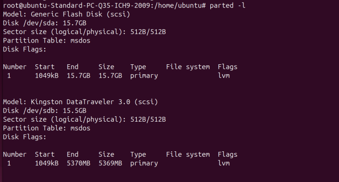

It needs to have a PV and VG attached to it.
We create PVs for those two partitions:
```bash
pvcreate /dev/sda1 /dev/sdb1
```

And a VG for these:
```bash
vgcreate myvg /dev/sda1 /dev/sdb1
```

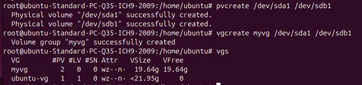

OBS: To extend the VG: ```vgextend myvg /dev/sdc1```

Now, we allocate two 10GB LVs:
```bash
lvcreate --size 10g --type linear -n mylv1 myvg
lvcreate --size 10g --type linear -n mylv2 myvg
```

OBS: Since the 15GB went for 14.7 GiB, two 20g LVs wat insufficient. Then, 10g and 9g was proposed:

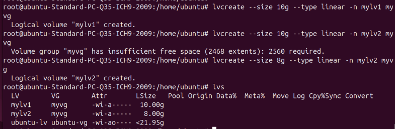

The linear type was choosen that is the simplest without redundancy, however for it and backups we have **raid**, **snapshot**, **mirror**, **cache** and so on.

Now it is time to create filesystems:
```bash
mkfs -t ext4 -L USB1 /dev/mapper/myvg-mylv1
mkfs -t ext4 -L USB2 /dev/mapper/myvg-mylv2
```

And mount it:
```bash
mount /dev/mapper/myvg-mylv1 /mnt/lv1
mount /dev/mapper/myvg-mylv2 /mnt/lv2
```

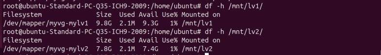

To try the LVM capabilities, we remove the LV and remanage the PVs:
```bash
lvremove myvg/mylv2
```

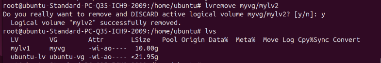

While the other LV is mounted, we can resize it (the LV and filesystem must do this operation). The option -r for ```lvresize``` already does it:
```bash
lvresize -r -l +100%FREE myvg/mylv1
```

However, for learning purpose we do it separately.

First we check the available extents:

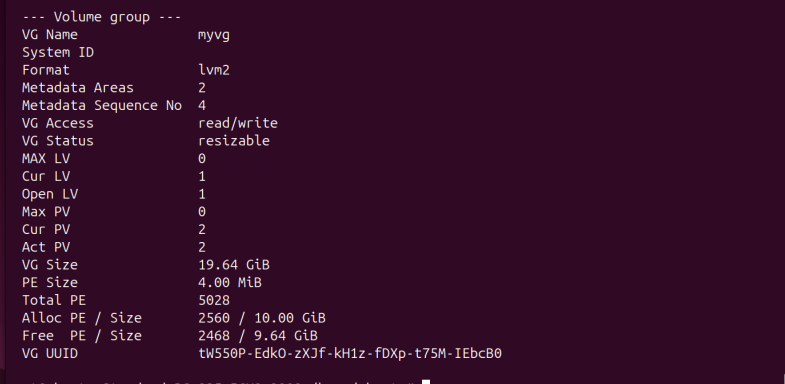

Let's all of it to mylv1:
```bash
lvresize -l +2468 myvg/mylv1
```
And resize the filesystem:
```bash
fsadm -v resize /dev/mapper/myvg-mylv1
```
By default, it occupies all the disk.

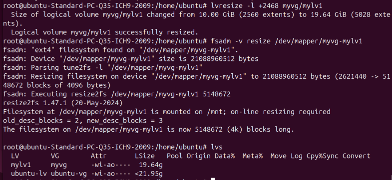

### Implementation

LVM operation is all under user space. For kernel, it uses **device mapper** (or ```devmapper```, a kernel driver) as a layer between block devices and filesystem to create mapping tables. It manages writes and reads for each other. The steps in user space are as follows:
1. find all PVs
2. find all VGs belong to by UUID (contained in the PVs on its header)
3. verification
4. find all LVs
5. map data from a scheme provided by PVs into LVs

To check the devmapper setup and info:
```bash
dmsetup info
dmsetup table
```

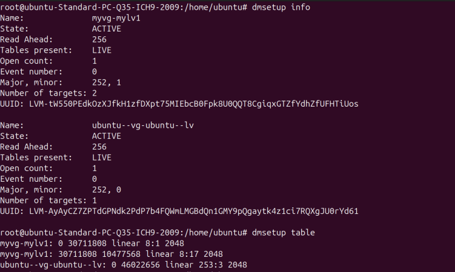

From this example, after the resize the devmapper insert the first new LV for the first sector. The 10g capacity is after.


### LVM vs Ceph
A little breakdown for a comparison between LVM and Ceph:

1. **Physical Volume - Object Storege Daemon**
  A physical disk or a partition that initialize to be part of the LVM system/Ceph cluster, equivalent of a raw disk resource
2. **Volume Group - RADOS Cluster/Pool**
    A pool of storage that combines one or more Physical Volumes to be carved up into Logical Volumes for a **single host**. For Ceph, it also represents the pool of storage from all OSDs however for all **servers in the cluster** and for the same OSD it can have multiple Ceph Pools (here it manages rules for replication and protection)
3. **Logical Volume - RBD image**
    Each Logical Volume/RBD image is presented to the operating system as a block device(e.g., ```/dev/sda```) managaeable by the administrator (to format it to a filesystem for example)
4. **Logical Extent - Object**
    The Logical Extent/Object is the smallest chunk of data storage` of a Logical Volume/RBD image (4MB by default)

OBS: Ceph has a special step where resides the Placement Groups (PGs), which implements the rules that RADOS Pool requires (e.g., replicate it 3 times) by hashing objects to it (Pool operates logically and PGs are the internals that group Objects and enforce policies)

The hierarchy goes:
- LVM: PV <-> VG <-> Extent <-> LV
- Ceph: OSD <-> PG <-> RADOS Pool  <-> Objects <-> RBD Image

For a write in user perspective in Ceph:
1. App write (```echo "hello" > /mnt/userceph/file.txt```)
2. Ceph client software(```librbd```) to intercept the write and translates it into Objects (name and offset)
3. RADOS Pool identification(```userceph``` belongs to Pool A, with rules to have 3 replicas and 128 PGs)
4. PG gets the Object and Pool properties (total number of PGs and which PG is responsible for that Object): ```hash(Object A)``` + Pool A rules -> PG A
5. OSD calculation (Primary OSD 1, Replica OSD 5, Replica OSD 8)
6. Write to OSD and it acks to the client/app


