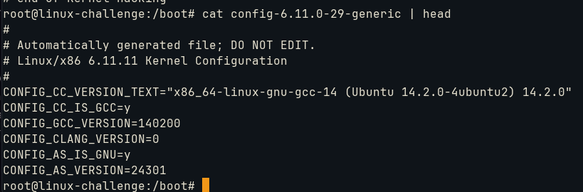
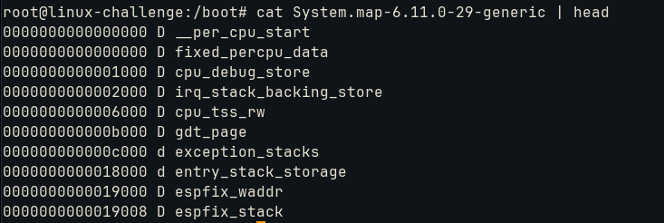
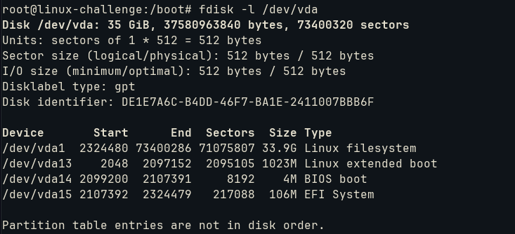
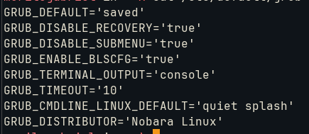
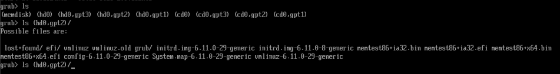

# Install a boot manager

The lessons towards GRUB were well defined. However, let's get a summary on how to implement from zero. The contents for a boot partition are:
- config file: configuration parameters for Linux Kernel



- system map: table that corresponds variables or functions to its position in memory



- linux kernel: binary of kernel OS
- initrd: minimal root filesystem into RAM


Upon determining the boot device (disk that will reside GRUB), we mount it temporarily:



OBS: This system specially only has a boot directory under ```/dev/vda13```. No need to mount it

```bash
# if boot partition exists
mkdir /mnt/tmp
mount /dev/vda13 /mnt/tmp
grub-install --boot-directory=/mnt/tmp /dev/vda13
```

Since it does not have it, proceed to install grub:
```bash
grub-install --boot-directory=/boot /dev/vda13
```

Some options appear under ```/etc/default/grub```:



- GRUB_DEFAULT: default menu entry to boot (if *saved* it uses the last one)
- GRUB_SAVEDEFAULT: default boot option will always be the last one selected
- GRUB_TIMEOUT: time to choose an entry
- GRUB_CMDLINE_LINUX: command line options
- GRUB_CMDLINE_LINUX_DEFAULT: command line options to the default entry
- GRUB_ENABLE_CRYPTODISK: for disk encryption


To manually boot from GRUB shell, we must find the ```initrd``` and kernel location:



From the example, it resides inside ```hd0``` at ```gpt2``` partition. Inside there, it has the initrd image and the linux kernel(vmlinuz):
```bash
set root=(hd0,gpt2)
linux /vmlinuz-6.11.0-29.generic root=dev/sda1
initrd /initrd.img-6.11.0-29-geneic
boot
```

On rescue shell, we must load GRUB modules first. A prefix into the GRUB files is the start point:
```bash
set prefix=(hd0,gpt3)/boot/grub
insmod normal
insmod linux
```

And the same procedure goes again.

To install GRUB legacy:
```bash
root (hd0,0) #it starts from 0, unlike GRUB2
setup (hd0) #install it into the MBR
```


