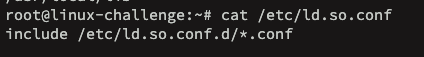
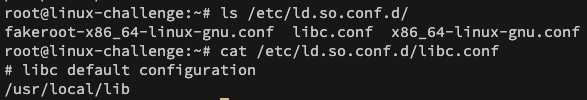

# Manage shared libraries

Functions or classes precompiled to be used by various programs. The compilation must follows:
- source code into machine code (object file creation)
- object files are linked into a executable file
    - to do it statically, at link time it merges the libraries and no dependencies are needed afterwards
    - to do it dynamically, the libraries are stored as references and at run time **shared libraries (.so file)** must be available to attend the dependency

Most Linux systems contain shared libraries for its binaries. For example ```libc```: 


These files are located at ```/lib```, ```/lib64```, etc. In Windows, these concepts are the same for DLL files (dynamic linked libraries).


The dynamic linker(```ld.so``` or ```ld-linux.so```) is in charge to resolve these dependencies (curious that it is also a shared library). It searches for special directories configured under ```/etc``` at ```/etc/ld.so.conf``` (or as files at ```/etc/ld.so.conf.d/```):



On this *.conf files, the absolute path for the .so files must be provided:



The process ```ldconfig``` is in role to read these config files, create symbolic links in order to locate the individual libraries and update the cache file ```/etc/ld.so.cache```. It must be issued for every configuration made for reload.

For example:


The libfuse example shows the symbolic link on cache for the absolute path. We could add this temporarily:
```bash
LD_LIBRARY_PATH=/usr/local/libs
```
Or permanently into .bashrc or /etc/bash.bashrc:
```bash
export LD_LIBRARY_PATH=/usr/local/libs
```

## Finding dependencies

We can check the current shared libraries dependent for a program:
```bash
ldd /usr/bin/program
ldd -u /usr/bin/program #unused dependencies
```

To evaluate object files, we could use ```objdump``` with -p option to print private headers:


Here for libc we have the dependency (ld.so file) and the .so name for generation.


