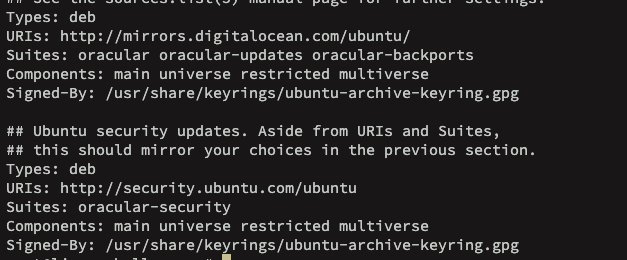

# Debian package management

## dpkg

To install a .deb package:
```bash
dpkg -i *.deb
```

To remove:
```bash
dpkg -r *.deb
```

Get info:
```bash
dpkg -I *.deb
```

List all installed packages: 

```bash
dpkg -L package
```

To get which package owns a file:
```bash
dpkg-query -S /usr/bin/file
```

After installation, a post-script run in order to set permissions and rules for configuration files. To reset it:
```bash
dpkg-reconfigure package
```

## apt

The Advanced Package Tool (apt) works in order to add functionality to the older dpkg package manager. It maintains repositories, automatic dependency resolution and advanced search capabilities.

To install, remove and upgrade a packge
```bash
apt-get install
apt-get remove
apt-get remove --force #force removal
apt-get update #update package index
apt-get upgrade #actually update packages
apt-get purge #include config files
apt-get install -f #install missing dependencies
apt-get clean #to empty .deb cache files
```

OBS: Cache files are normally resided at ```/var/cache/apt/archives```

To perform searches:
```bash
apt-cache search
apt-cache show #for detailed information
```

And finally to search for files from packages:
```bash
apt-file update #package cache update
apt-file list package #files associated with the package
apt-file search file #package associated with the file
```

OBS: ```apt``` and ```apt-get``` are interchangeable on the most cases

The repositories which the package manager queries for package availability are under ```/etc/apt/sources.list```. On some systems (like Ubuntu), it is now stored as files into the directory ```/etc/apt/sources.list.d/```. For Ubuntu, it is ```/etc/apt/sources.list.d/ubuntu.list```:



Since I use a Digital Ocean VPS, it has its own repos together with the Ubuntu. We could create a .list file under this directory and add personalized repos:
```bash
vim /etc/apt/sources.list.d/custom.list
deb http://deb.debian.org/debian buster-backports main contrib non-free
deb-src http://us.archive.ubuntu.com/ubuntu/ main #Debian Source packages and under its guidelines
```

A ```apt-get update``` includes these for future installations.

