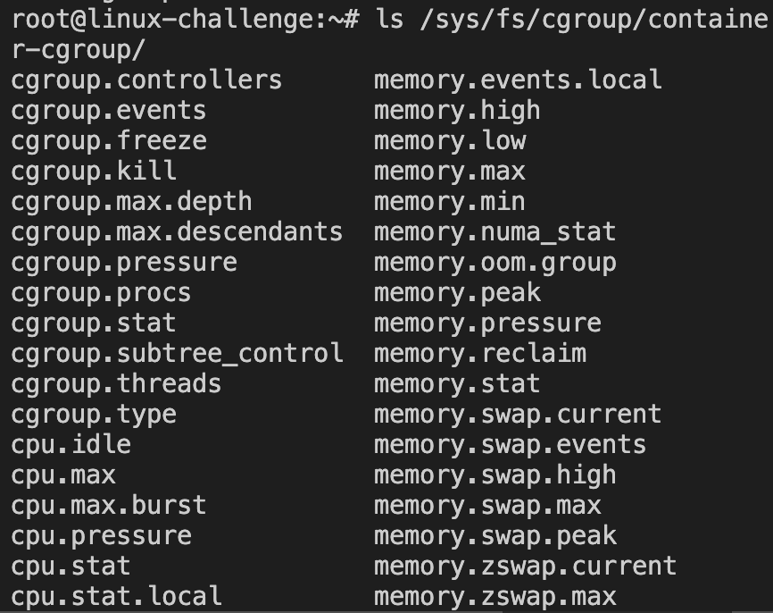

# Linux as a virtualization guest

The virtualization purpose is to create isolated environments to run multiple systems/processes. It is done on software and the management layer is upon the **hypervisor**, just how the operating system handles processes. They are classified:
- hypervisor type 2 (hosted): above an operating systems with its resources abstracted
- hypervisor type 1 (baremetal): directly on hardware

The memory, CPU and even I/O peripherals are built upon virtualization. To bypass the virtual hardware between host and guest is known as *paravirtualization*. 

Back in the time, virtual machines only could run in user-mode. It presented problems since the kernel needs to perform kernel-mode operations. For it, the hypervisor is aware of the restricted instructions and emulate it to the host machine (performance tradeoff is minimal). Technologies emerged in order to avoid this (Intel VT-x and AMD AMD-V):
- VT-x: create a new mode for the host and the guest to perform these operations
- AMD-V: uses CPU extensions to not rely on software

## containers

Beyond the server isolation, the modern applications need to have process isolation in order to keep services from interfering each other.

One method of service isolation (**chroot jail**) is through ```chroot()```, a system call to change the root directory so the program is unable to communicate with nothing outside it.

Other method is the resource limit(**rlimit**), which restricts how much CPU time a process can consume and its storage.

OBS: Containers reside on the same kernel, however can use different user-spaces environment. It manages **namespaces** to handle only a set of process IDs (start at PID 1) from itself and its children.

As previously noted, Docker uses **overlay** filesystem to manage the storage in layers (lower and upper):


The Docker and host directories are merged into a single spot. In rootless mode(Podman based), the FUSE version is used (maintains the container in user-mode).

### implementation

Let's try to implement our own engine to run a container. It is just to illustrate these concepts and will have limitations.


First, we must have an overlay filesystem and would have the following hierarchy:
- lowerdir: read-only container base image
- upperdir: writeble changes on host
- workdir: internal directory for overlayfs
- merged: unified view as root filesystem to the container

For our "container image", we will use ```busybox```. It contains common Unix utilities on a single small executable. We install it:
```bash
apt install busybox
```

#### overlayfs and namespaces

Once installed, we create our base filesystem that which will compose the lower layer directory for the overlayfs:
```bash
mkdir -p container/bin
```

And copy the ```busybox``` exectuable into that directory and create a symlink for two commands(```sh``` and ```ls``` in busybox): 
```bash
cp $(which busybox) ./container/bin
ln -s busybox ./container/bin/sh
ln -s busybox ./container/bin/ls
```

OBS1: The symlink is created to a relative path for busybox, so it searches on the same directory.
OBS2: The busybox feature is a multi-call binary, it cleverly decides which command to run by checking the name it was called with(```sh``` and ```ls``` in this case).

Afterwards, we can mount it as an overlayfs:
```bash
mkdir upper work merged
mount -t overlay overlay -o lowerdir=./container/,upperdir=./upper/,workdir=./work/ ./merged
```

We call options and initializes the directories as layers.


Try to create a file inside it:


The write was only at the upperdir(/upper) and the merged directory(/merged/). 

The script needs to automate this process inside the container image.

Now we want to create a namespace to our instance. For it, we use the command ```unshare``` that has the following options:
* --pid: isolates PID number space
* --mount: isolates mount points (important for overlayfs lowerdir)
* --uts: isolates hostname and domain name
* --ipc: isolates inter-process communication
* --net: isolates network stack
* --user: isolates user and group IDs

The problem with the mount with overlayfs previously was that it is visible to all the system host:


Now we will unmount and create a mount point inside a namespace:
```bash
umount ./merged
```

To create a namespace with a shell as a new child process(--fork):
```bash
unshare --mount --fork /bin/sh
```

Inside this shell we mount the overlayfs all over again:
```bash
mount -t overlay overlay -o lowerdir=./container,upperdir=./upper,workdir=./work ./merged
```

Consequently, the filesystem is not shown in the host shell:


However, it takes the same effect on unshare shell:


When the shell is closed, automatically the filesystem is unmounted.

The overlayfs uses ```mount()``` system call and it needs root privileges. For rootless containers, the alternative is ```fuse-overlayfs```, and it acts as an intermediary layer between user and kernel. For that reason, a context switch makes the performance lower than directly with a system call, but adds security. The procedure would be the same with a mount call different:
```bash
fuse-overlayfs -o lowerdir/.container,upperdir=./upper,workdir=./work ./merged
fuserumount -u ./merged
```


#### cgroups

For resource allocation, we use ```cgroups```(Control Groups). It is managed at ```sys/fs/cgroups``` directory and there is listed the resources:


OBS: From the directory tree, it is under **cgroups v2** because it is unified. Previously on **cgroups v1** the controller were separated from resource(```./memory```, ```./cpu```...)

We create a cgroup inside it:
```bash
mkdir /sys/fs/cgroup/container-cgroup
```

The control files are automatically created:



We add a 100MB limit to the memory:
```bash
echo +memory | sudo tee /sys/fs/cgroup/container-cgroup/cgroup.subtree_control
echo 100M | tee /sys/fs/cgroup/container-cgroup/memory.max
```

OBS: The resource must be announced to subtree directory controller

To add the current shell as a process inside it:
```bash
echo $$ | sudo tee /sys/fs/cgroup/container-cgroup/shell/cgroup.procs
```

OBS1: The special parameter $$ expands to the PID of current shell

OBS2: The cgroup handles it in parent/child hierarchy, processes are under an internal node and the leaf node can limit its resources. On this example, the memory up to 100M is limited for all nodes under the leaf ```container-cgroup```  and we added the shell into a task inside it.

We could even just limit the shell atomically:


The memory limit can be tested with ```stress-ng``` feature:
```bash
sudo apt install stress-ng
```

We issue a value to test:
```bash
stress-ng --vm 1 --vm-bytes 101M
``` 

On kernel logs we can check:
```bash
dmesg | grpe -i "killed process"
```


This is how the resources are bounded in containers.

#### chroot

The final step is to isolate the root filesystem from the host and the container. The command ```chroot``` provide it for the process and the new root directory.

The mount point namespace that we created ensured that mount/unmount operations do not affect the host filesystem.

Previously, we used a new namespace to actually mount a overlay filesystem. Now, we will jail into the merged layer:

```bash
unshare --mount --fork chroot ./merged /bin/sh
```

In the end, filesystem operations and its view is fully restricted.
The ```unshare --mount``` takes a snapshot fot the host's list of mounts for the new process so it can view the ```./merged``` prepared.

A bash script to perform each step has been created, the ideia is to simulate the ```docker exec```  command inside a running container.


## virtualization

The common hypervisors are:
- Xen: open-source type-1 hypervisor (or baremetal)
- KVM: kernel module for virtualization under ```libvirt``` daemon for both type-1 and type-2
- VirtualBox: type-2 hypervisor


And the virtual machines are classified:
- fully virtualized: no drivers necessary to translate instructions host-guest (Intel VT-x or AMD-V CPU extensions)
- paravirtualized: guest drivers for translation (KVM uses Virtio and VirtualBox uses Guest Extensions)
- hybrid

### KVM

Configuration files for KVM are XML based:
```bash
 sudo cat /etc/libvirt/qemu/networks/default.xml
 #output
 <!--
WARNING: THIS IS AN AUTO-GENERATED FILE. CHANGES TO IT ARE LIKELY TO BE
OVERWRITTEN AND LOST. Changes to this xml configuration should be made using:
  virsh net-edit default
or other application using the libvirt API.
-->

<network>
  <name>default</name>
  <uuid>513718c7-c70f-49c5-8ff4-b720552fe739</uuid>
  <forward mode='nat'/>
  <bridge name='virbr0' stp='on' delay='0'/>
  <mac address='52:54:00:5e:f7:e1'/>
  <ip address='192.168.122.1' netmask='255.255.255.0'>
    <dhcp>
      <range start='192.168.122.2' end='192.168.122.254'/>
    </dhcp>
  </ip>
</network>
```

Here shows an emulated hardware ```virbr0``` to act as a router for this network (IP range, DHCP, NAT, MAC address). The other default file from RHEL defines the core of the VM, which includes the amount of RAM, CPUS, display capabilities, USB access and so on.

Images that virtual machines can use:
- Copy-on-write: the disk file is used on demand, the upper limit is defined however it will only increase as new data is written (```qcow2``` for QEMU COW)
- raw: pre-allocation of disk file, more performatic since it avoids monitoring


Linux installations generate a machine identification called **D-Bus machine ID**. If the VM is cloned, the D-Bus machine ID must be regenerated in order to ensure that IPC and RPC goes to the right systme. To validate:
```bash
dbus-uuidgen --ensure
#should show no errors
dbus-uuidgen --get #gets the ID
```

The ID is located at ```/var/lib/dbus/machine-id``` and symbolically linked to ```/etc/machine-id```. If two VMs have the same ID, to generate manually:
```bash
rm -f /etc/machine-id
dbus-uuidgen --ensure=/etc/machine-id
```


