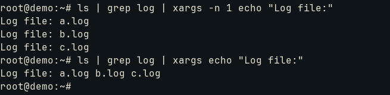

# Use streams, pipes and redirects

Lesson almost skipped due to Linux Challenge course.
We will summary ```xargs```, which is a powerful tool for intermediate input/output between programs. It uses the contents via stdin to run a given command as its arguments:
```bash
find /usr/share/icons -name 'debian*' | xargs identify format "%f: %wx%h\n"
```

The ```xargs``` here is needed because ```identify``` does not expect a standard input, but actually arguments. In the end, it creates a translation between stdin and args. Some options:
* -n 1: one argument at a time
* -L 1: one line per command execution
* -0: null char as separator
* -I: input holder (normally curly braces {})
* -p: prompt
  

The flow:
```bash
echo "World" | xargs echo "Hello"
#output: Hello World
```

In this example, ```xargs``` get World and adds as argument to the following ```echo``` command: ```echo "Hello" "World"```


The prompt:
```bash
find . -name "*.log" | xargs -p rm
```

It will asks for execution (y or n).

For -n:


For input management:
```bash
ls | grep log | xargs -I {} mv {} {}.bak
```

It gets the output as {} and handles it with ```mv``` to add a .bak extension to the file.

