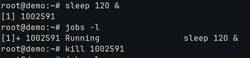
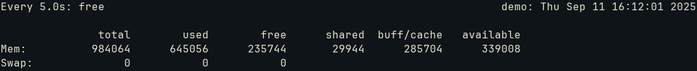

# Create, monitor and kill processes


Foreground and background processes management.
To check the ones that are on background:
```bash
jobs -l
```

The option -l allows the PID to be exposed (to send signals for example):



To bring to foreground:
```bash
fg %1
```

The option %1 selects the first process. By default, it selects the last one. We could stop it with Ctrl+Z or terminate it with Ctrl+C.

To take it to the background:
```bash
bg
```

To kill the first process:
```bash
kill %1
#or
kill pid
#or even query the pid
kill $(pgrep command)
```

We could even kill are programs related:
```bash
killall command
#or
kill -1 pid
```

The above commands invoke the process and attach it to the current session. If the session(or shell) is terminated, all the processes are terminated too. To detach it and run even if closed:
```bash
nohup command &
```

To monitor an output of a program, we can use ```watch```. It starts the process every interval and checks the output:
```bash
watch -n 5 free
```

After every 5 seconds, it monitors the ```free```:




