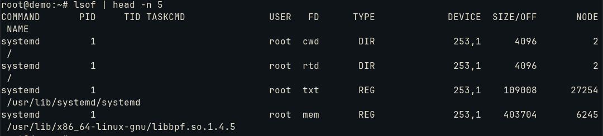

# Create, monitor and kill processes


Foreground and background processes management.
To check the ones that are on background:
```bash
jobs -l
```

The option -l allows the PID to be exposed (to send signals for example):


To bring to foreground:
```bash
fg %1
```

The option %1 selects the first process. By default, it selects the last one. We could stop it with Ctrl+Z or terminate it with Ctrl+C.

To take it to the background:
```bash
bg
```

To kill the first process:
```bash
kill %1
#or
kill pid
#or even query the pid
kill $(pgrep command)
```

We could even kill are programs related:
```bash
killall command
#or
kill -1 pid
```

The above commands invoke the process and attach it to the current session. If the session(or shell) is terminated, all the processes are terminated too. To detach it and run even if closed:
```bash
nohup command &
```

To monitor an output of a program, we can use ```watch```. It starts the process every interval and checks the output:
```bash
watch -n 5 free
```

After every 5 seconds, it monitors the ```free```:


To find open files we use ```lsof```:



The readibility is:
- command
- pid
- user
- fd: purpose of the file or descriptor
- type: regular file, directory, socket...
- device: major and minor number for device holder
- size/off
- node: inode file
- name

To limit it for a directory:
```bash
lsof +D /usr
```

For a PID:
```bash
lsof -p pid
```

To get the a summary of the options:
```bash
lsof -h #or --help
```

## multitask

Processes operates into CPU core time slots. Each process is selected via *system calls* (OS process to CPU control) and the interval between the response from CPU is allocated for another program. 

However, programs that do not use system calls would use the CPU indefinitely. The workaround is **preemption**, which has a timer that calculates the CPU slice for the process to forcibly interrupt it and proceed with the queue.

The master for this management is the **scheduler**. It can be defined into policies and priorities:
* real-time policy: critial tasks with 0-99 priority number
* normal policy: system and user programs with 100-139 priority number which have same priority value and influenced by their "nice value" (-20 to +19 or 100 to 139 priority number) based on aggressive CPU utilization need.


