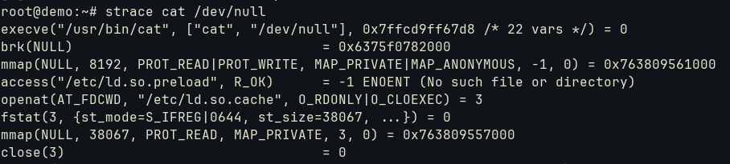
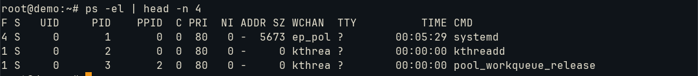
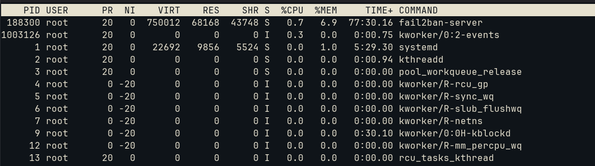
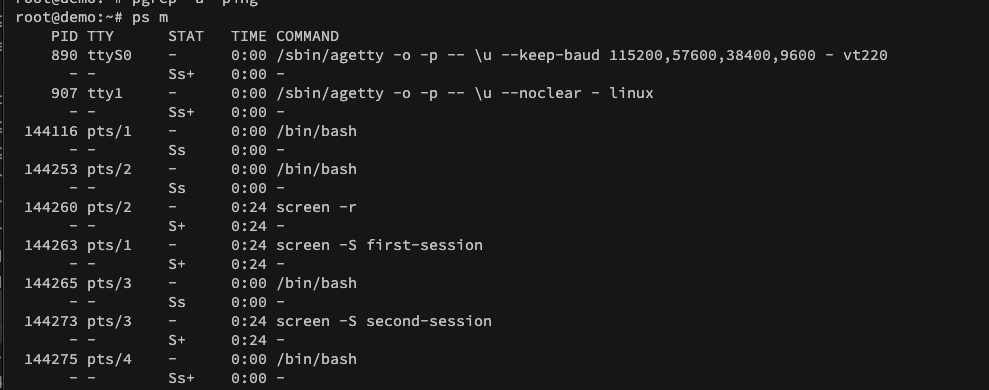
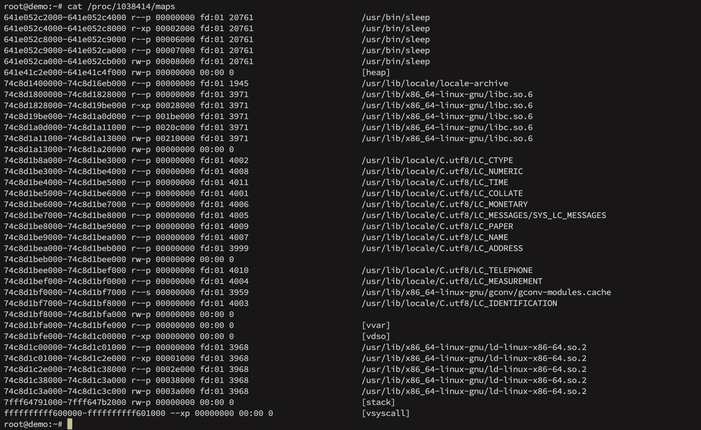
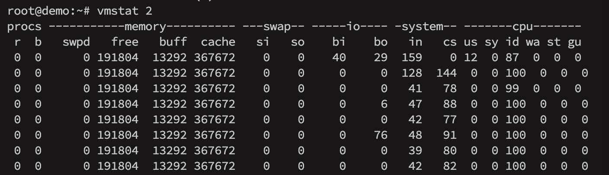
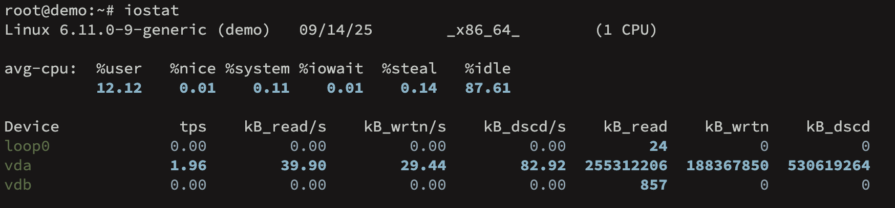
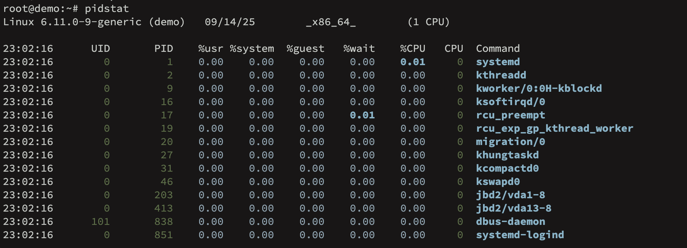

# Modify process execution priorities
Priority under multitasking and multithreading system


## multitask

Processes operates into CPU core time slots. Each process is selected via *system calls* (OS process to CPU/kernel control) and the interval between the response from CPU is allocated for another program. 

To monitor the system calls made:
```bash
strace command
```

Previously, the learned that one process can start another with *fork()* syscall to spawn a copy and *exec()* to start a new program. The ```strace``` monitors after the *fork()* call:



From the image, we see that it starts with *exec()* family syscall (*execve()*) and then memory initialization(*brk()*).

To only monitor library calls, we can use ```ltrace```. It does not track anything at kernel level.

However, programs that do not use system calls would use the CPU indefinitely. The workaround is **preemption**, which has a timer that calculates the CPU slice for the process to forcibly interrupt it and proceed with the queue.

The master for this management is the **scheduler**. It can be defined into policies and priorities:
* real-time policy: critial tasks with 0-99 priority number
* normal policy: system and user programs with 100-139 priority number which have same priority value and influenced by their "nice value" (-20 to +19) based on aggressive CPU utilization need.


To check priorities, we look into PRI field from ```ps -el```:



For historical values, the ```ps``` uses -40 to 99 priority numbers. In other words, all the processes listed are under normal policy with 120 as its priority. The ```top``` command also has the same field (which also has a different priority number, it reduces by 100): 



The field NI indicates the process niceness (if under normal policy). As we can see, some programs require an aggressive amount of CPU slice. We could start a process with this value modified:
```bash
nice -n 15 tar czf home.tar.gz /home
```

If already in activity, we can ```renice``` it:
```bash
renice -10 -p pid #reduces 10 from niceness
#we can specify a group(-g) or an user(-u)
```

## multithread

A thread is similar to a process with an identifier (thread ID or TID) and the kernel scheduler runs threads just like it. However, all threads inside a single process share their system resources and some memory.

The primary advantage is the intercommunication with their shared memory instead of network connection or pipe. To overcome multiple I/O resources, which usually *fork()* itself to handle a new input or output stream, the thread offer a similar mechanism without overhead to start a new process.

To check how many threads a process is using, we use:
```bash
ps m
```



The dashes indicate how many threads is being used.


## memory management unit

The Linux kernel uses an abstraction layer for memory access named MMU with **virtual memory**. The process perception is full access to full memory, which localization is actually the physical address.

The job for MMU is translate virtual address into actual physical RAM address. It maintains a **page table**, which associates a chunk of virtual memory named **page** to a chunk of physical memory named **frame**. For each process, the kernel maintains a page table that maps every page to a frame.

Each entry in the page table contains the frame number (register), the permission bit (flag if the page can be read/write/execute) and present bit (flag if the page is currently in RAM or on swapping).

The step by step action:
- CPU request: a program request data from virtual memory (let's say into 0xAE1)
- MMU: intercepts the request and split the virtual memory address into page number (e.g., 0xAE) and an offset (e.g., 0x1) into that page
- table lookup: check the corresponding entry on page table (frame address and flags, e.g., 0xAE -> 0x1B)
- offset combinaton: the physical frame address and the offset indicates the original memory (e.g., 0x1B + 0x1: 0x1B1)
- fetch data

If the data is absent on memory (the present bit is off), it triggers a hardware exception called **page fault**. The kernel handles it, check the required page on swap file, loads it into an empty frame in RAM, updates the page table to point to the new physical address location and tells the MMU to try the instruction again.

A page fault can be classified:
- minor: the page is on the memory but the MMU does not know where it is
- major: the page is not in the memory at all, then it starts the swapping process

Let's check it on terminal. We issue a command and get its PID:
```bash
sleep 1000 &
pgrep sleep
```

For page table, it is shown under ```/proc``` directory:
```bash
cat proc/$(pgrep sleep)/maps
```



Each column represents respectively:
- virtual address range
- permissions (read, write, execute and private)
- offset (00002000 in bytes is 4kB), the second line for example tells that there is an executable starting on 4096 bytes at /usr/bin/sleep program
- the last column shows what is mapped into the virtual memory region

A user process does not need all of its memory pages allocated. It is done on demand and called **demand paging**.

To get the ammount of data on a page:
```bash
getconf PAGE_SIZE
#output
4096
```

With ```vmstat``` command we can check the operations on memory in real time:



The output has categories: *procs* for processes, *memory* for memory usage, *swap* for swapped pages, *io* for disk usage, *system* for kerne; switches and *cpu* for time slots.

The *swpd* column indicates how much memory is swapped while *free* indicates real memory and *cache* the amount on buffer. The important ones are *si* and *so*, which informs memory swapped in and out which is special during troubleshoot of memory fault. The columns *bi* and *bo* are the same but regarding blocks. Finally, the column *b* is the block memory while waiting for pages.

The *us*, *sy*, *id* and *wa* columns represents respectively the percentage of CPU usage, number of kernel tasks, idle time and waiting for I/O.

## I/O monitoring

The ```vmstat``` command show a few I/O stats, however ```iostat``` provides more details:



The *avg-cpu* shows the CPU utilization. Below the other ones:
* tps: data transfers per second
* kB_read/s: kilobytes read per second
* kB_wrtn/s: kilobytes written per second
* kB_read: total of kilobytes read
* kB_wrtn: total of kilobytes written

To monitor it every 2 seconds:
```bash
iostat 2
```

The option ```-d``` is used for only device report. To show partition information we can use ```-p```.

This command is for whole I/O utilization under disk, to separate for each process we use ```iotop```:
x
[iotop](../images/iotop.png)

As we can see, ```iotop``` shows the thread ID - TID instead of PID. The PRIO should not be associated with the CPU priority, because it indicates the I/O priority and affects how quickly the kernel schedules read and writes to it.
For example, the *be/4* states the **scheduling class** followed by the priority 4:
- be: best effort
- rt: real time for utmost priority before any other class
- idle: idle to only when no other I/O is being used


## process monitoring

For process statistics, we can use ```pdstat```:



We could query it under a single PID and to update every 1 second:
```bash
pidstat -p pid 1
```

The default output shows user and system time and overall percentage of CPU time, it even shows which CPU is handling the process.

It has multiple options. For example, ```-r``` to monitor memory and ```-d``` to monitor disk.