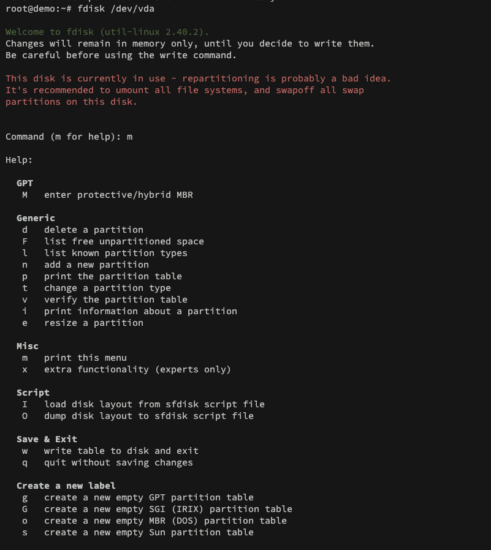
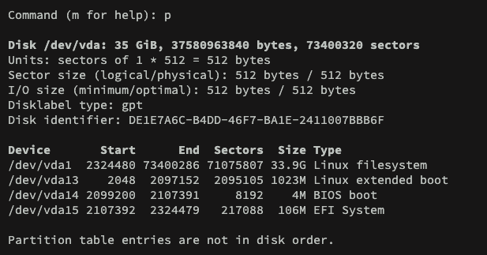
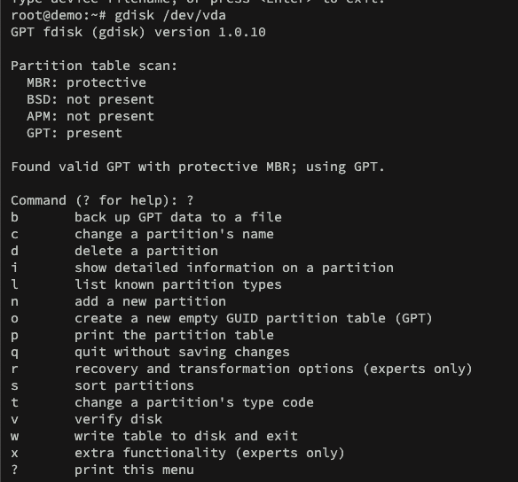
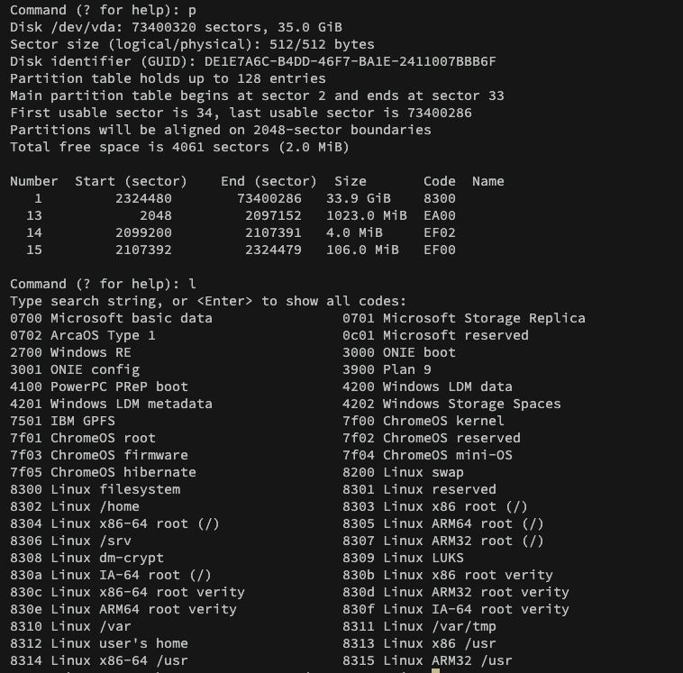

# Create partitions and filesystems

Let's recall filesystems concepts.
First, the partition tables:
- MBR: Remnant of MS-DOS which is stored on the first sector of a disk (boot sector) along with boot loader. The limitations are 2TB in saze and 4 primary partitions per disk.
- GPT(GUID Partition Table): No need to store it on first sector, no practical limit on size and the partitions number are limited by the OS.

## MBR
For MBR partition table, we use ```fdisk```.
Let's grasp it again:



The most important:
- p: print partition table
- n: create a partition
- F: list free unpartitioned space
- d: delete partition
- l: list known partition types
- w: write changes
- q: quit



For this VPS, the GPT partition table is being used.
A important mention is that MBR allocate according to the *maximum amount of contiguous unallocated space*.
It is a historical reason, since MBR only stores the starting location and its total size.

## GPT

To GPT we use ```gdisk```:



The most important ones:
- n: new partition
- o: new GUID partition
- p: print partition table
- t: change partition code
- l: list partition types
- w: write
- q: quit

From the options, we see recovery to lost/damaged data which is a feature new to GPT.




## Btrfs filesystem creation

We have seen about XFS, ZFS and even EXT3/EXT4. However, what about btrfs?

```bash
mkfs.btrfs /dev/sda1
```

To label it:
```bash
mkfs.btrfs /dev/sda1 -L "Label 1"
```

To apply a span of devices into a single filesystem:
```bash
mkfs.btrfs -d single -m single/raid*/dup -m /dev/sda /dev/sdb
```
OBS: ```-d``` is for data block and ```-m``` is for metaata block groups.

The metadata is what provides the capability of restoration and replication, which acts as a index for all the data block. 
For high metadata safety on a budget disk:
```bash
mkfs.btrfs -d single -m dup /dev/sda /dev/sdb
```

The data is written once and metadata is written twice (bit rot and bad sector).

For high performance with metadata safety:
```bash
mkfs.btrfs -d raid0 -m raid1 /dev/sda /dev/sdb
```

The data is separated per file between disks and every metadata block is mirrored.

To create a subvolume:
```bash
btrfs subvolume create /mnt/disk/backup
```


