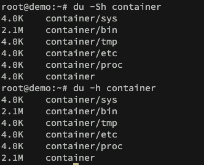
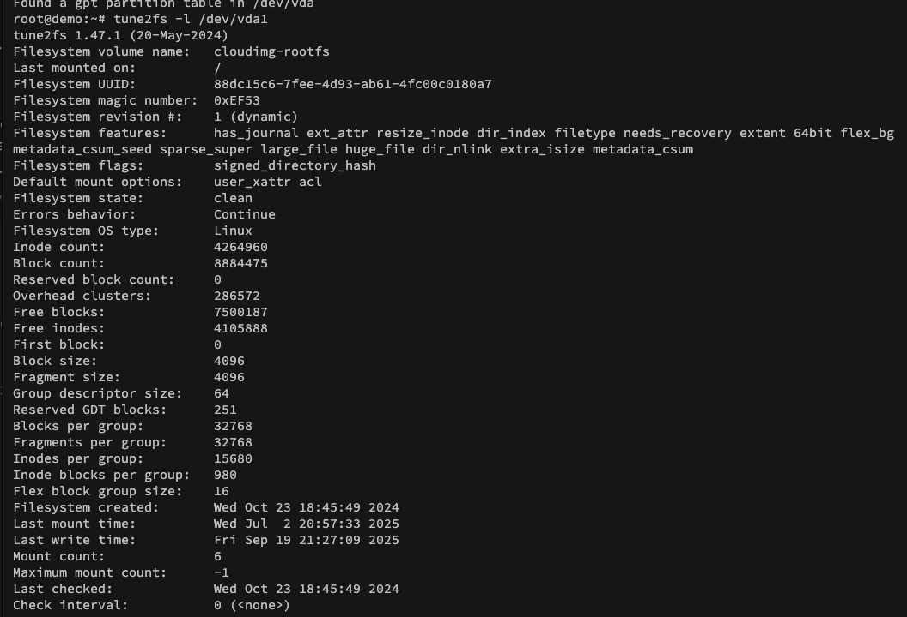

# Maintain the integrity of filesystems

Again, we will summary some concepts already learned and add usages to it.

## du
For disk usage, we use ``du``. By default, it only shows usage count per directories. To show individual files:
```bash
du -ah
```

To exclude size from subdirectories:
```bash
du -Sh
```



The directory container has 2.1M on total and without the subdirectories size it has only 4.0K (size for empty directory). To include the difference:
```bash
du -Shc
```

To control how deep the disk usage calculation should go under the directory tree, we use:
```bash
du -h -d1
```

In this case, only the main directory is taken into account.
To filter a pattern:
```bash
du -ah --exclude="*.bin"
```

## df
For free space, we use ``du``.
To show available inodes instead of blocks:
```bash
df -hi
```

To check the filesystem:
```bash
df -hT
df -h -t filesystem #include only the filesystem provided
df -h -x filesystem #exclude the filesystem provided
```

## check and tune filesystems

To check for errors, we can use ``fsck``:
```bash
fsck /dev/sdb1
fsck -N /dev/sda1 #perform check with any modification
```

OBS1: It needs to be unmounted
OBS2: ``fsck`` only checks for the right utility for the designated filesystem (e.g., ``e2fsck`` for ext* filesystem)

To automatically attempt a error fix:
```bash
fsck -py /dev/sda1 #p to fix and y to answer yes to all questions
```

The ext# filesystems has parameters to tune it for a better suit. The utility is called ```tune2fs```.
To list the parameters:
```bash
tune2fs -l /dev/sda1
```



For example, we could define a maximum mount count and upon exceeded the partition would be validated with ``fsck``:
```bash
tune2fs -c 5 /dev/sda1
```

Or we could define an interval for these checks:
```bash
tune2fs -i 10d /dev/sda1 #10 days for a health check
```

To define a label:
```bash
tune2fs -L partition1 /dev/sda1
```

To define an UUID:
```bash
tune2fs -U uuid /dev/sda1
```

Even the behavior for a kernel error found:
```bash
tune2fs -e continue/remount-ro/panic /dev/sda1
```

OBS: The default is to *continue*

To enable journaling:
```bash
tune2fs -j /dev/sda1
```

### reserved blocks

On a ext4 filesystem, a percentage of the disk is reserved exclusively for **root user**. It acts as a buffer for disk full situations, it ensures:
* root login
* delete and stop commands

Moreover, it reduces **fragmentation**, in a way that the system guarantees that is space to write files in contiguos blocks. To check it:
```bash
tune2fs -l /dev/sda1 | grep -i "reserved block"
```

And to insert a percentage to it:
```bash
tune2fs -m 1 /dev/sda1 #1% allocated
```

On older hardware, the disk size were much smaller. Nowadays, we can reduce it for more space and even restore a full disk to allow another operations without stopping the machine.

## XFS

The XFS alternative for ``fsck`` is ``xfs_repair``. To perform only a scan without repair:
```bash
xfs_repair -n /dev/sda1
```

A cool setting is to limit memory for the utility:
```bash
xfs_repair -m 100 /dev/sda1 #limits to 100MB
```

To debug:
```bash
xfs_db /dev/sda1
```

And to defragmentize (maintain contiguous data) an XFS filesystem:
```bash
xfs_fsr /dev/sda1
```