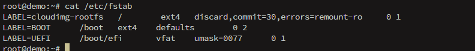

# Control mounting and unmounting of filesystems

We will learn how to mount under ``fstab`` and ``systemd``.

## /etc/fstab

The file ``/etc/fstab`` contains descriptions about the filesystems that can be mounted. The pattern is usual:
```bash
LABEL=name mountpoint type options dump pass
#or
UUID=uuid mountpoint type options dump pass
```

The *dump* indicates whether a filesystem should be considered for backup by ``dump`` command or not (normally 0 to ignore and it is indicated to be so). In other hand, *pass* indicates the order on bootup to be checked(normally 0 to disable, 1 is for root and 2 for other partitions).

For example:
```bash
/dev/sda1 / ext4 noatime,errors
```

Since zero is the default, dump and pass are ignored. The options *noatime* and *errors* are used, which indicates that is no need to update the access time for every time a file is read and which operations needs to be done if an error is encountered, respectively.



Some other options:
- auto/noauto: mount automatically
- defaults: rw,suid,dev,exec,auto,nouser and async options are summarized and passed
- dev/nodev: character or block devices in the mounted filesystem should be interpreted
- exec/noexec: allow permission to execute binaries
- user/nouser: allows a no-root user to mount the filesystem
- group: allows a user to mount if belong to the same group of owner
- owner: only owner can mount it
- suid/nosuid: allow SETUID and SETGID bits to take effect
  - setuid: executable run with privileges of the owner
  - setgid: executable run with privileges of the group
- ro/rw: read only
- remount: attempt to remount the filesystem if already mounted
- sync/async: do all I/O operations synchronously or asynchronously (sync as default, man page indicates that sync on media with limited write cycles may shorten life span)


## systemd

For systemd, all works around units/init processes. For a device mount, the extension ``.mount`` is used with a common syntax:
```json
[Unit]
Description=description

[Mount]
What=/dev/disk/by-uuid/UUID
Where=/dev/sda1
Type=filesystem
Options=options same used by mount

[Install]
WantedBy=target
```

An example:
```json
[Unit]
Description=External data disk

[Mount]
What=/dev/disk/by-uuid/56C11DCC5D2E1334
Where=/mnt/external
Type=ntfs
Options=defaults

[Install]
WantedBy=multi-user.target
```

OBS: The mount unit **must** have the same name as the mount point. In this example, the name should be ```mnt-external.mount```.

We reload and start the unit:
```bash
systemctl daemon-reload
systemctl start mnt-external.mount
```


A feature is to automount every time the mount point is accessed. We create an ``.automount`` file:
```json
[Unit]
Description=description

[Automount]
Where=/mnt/external

[Install]
WantedBy=multi-user.target
```

To activate is the same:
```bash
systemctl daemon-reload
systemctl start mnt-external.automount
```