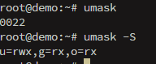
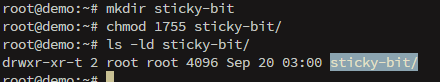

# Manage file permissions and ownership


# query group

To query which groups exist on the system:
```bash
getent group
```

And to query which group a user belongs:
```bash
groups user
```

And to query which users belongs to a group:
```bash
groupmems -g group -l
```


# default permission

The default permission is managed by ``umask``:



OBS: By default, ``umask`` shows it on octal mode and the leading zero can be ignored. In this case, it gives read permission for users and group.

For current session we could change:
```bash
umask u=rwx,g=rwx,o=
```

# sticky bit

A speciall permission that is also called restricted deletion flag. Octal value 1 and symbolic mode *t* within other's permissions. However, it applies only to directories and it prevents users from removing or renaming a file which he does not own.




OBS: Could be ``chmod o+t sticky-bit/``


# set GID

It was seen before. On files, it will make the process run with privileges of the group who owns the file (every file or directory created inherit the group from the parent directory). It has octal value 2 and symbolic mode *s* on group permissions. To add it:
```bash
chmod g+s file/directory
```

# set UID

Same as SGID, but with privileges from user who owns the file. It has octal value 4 and symbolic mode as *s* on user permissions. To add it:
```bash
chmod u+s file/directory
```

We could combine SGID and SUID on octal mode:
```bash
chmod 6755 test.sh #2+4=6
```