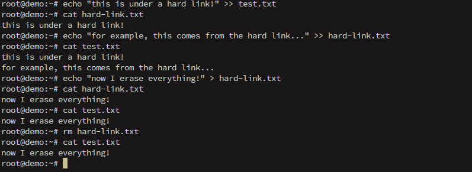

# Create and change hard and symbolic links

As seen previously, the **hard link** points to the same **inode** of the file.

OBS: An inode is a data structure that stores attributes of an object (file, directory, permissions, ownership, etc) on a filesystem, specifically the blocks allocated to this data.

## hard link

To create:
```bash
ln target link-name
#example
ln test.txt /home/murilo/test-link.txt
```

OBS: The link name can be omitted in order to create it with the same name as the target in the current directory

It is important to note that, even if it points to the same inode, a data deletion will not affect the data.



We could list the inode number for each file:
```bash
ls -li
```

## symbolic link

We need to add ``-s`` parameter to the ``ln`` command:
```bash
ln -s target link-name
```

Important to note is that if the path is not fully specified, it will remain as *relative* to the target. Consequently, if moved it can break.